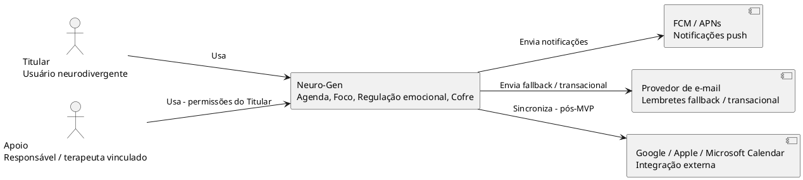
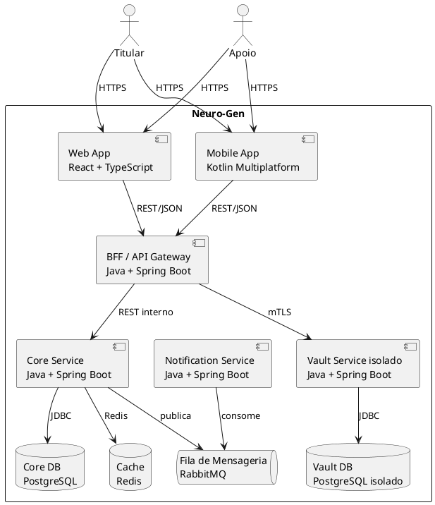

# Neuro-Gen — Design Doc: Arquitetura Geral do Sistema

**Versão:** 0.1
**Referência:** `01-visao-produto.md`, `02-requisitos-funcionais.md`, `03-requisitos-nao-funcionais.md`
**Constraint de entrada:** stack de backend fixada em **Java**.
**Decisões detalhadas:** ver `05-adrs.md` (ADR-001 a ADR-006).

---

## 1. Objetivo

Definir a arquitetura macro do Neuro-Gen — padrão arquitetural, camadas, stacks de backend/web/mobile e estratégia de dados — servindo de base para os design docs de cada módulo (Cofre, Sincronização, Notificações) na fase seguinte.

## 2. Escopo

Dentro: arquitetura de sistema (C4 nível Contexto e Container), stack tecnológica por camada, estratégia de dados e isolamento do Cofre, estratégia de deployment.
Fora: design detalhado de schema de banco, design de API (contratos OpenAPI), pipeline de CI/CD passo a passo — tratados em design docs subsequentes por módulo.

## 3. Contexto Atual

Projeto greenfield. Não há sistema legado. Constraint de negócio: stack de backend em Java (definida pelo usuário/organização).

## 4. Visão C4 — Nível 1 (Contexto)

## 5. Visão C4 — Nível 2 (Container)

## 6. Proposta — Racional por camada

### 6.1 Backend — Java + Spring Boot, Monolito Modular
Ver `ADR-001` e `ADR-002`. Estrutura em módulos (Agenda, Foco, Regulação Emocional, Organização, Permissões/Vínculo) dentro de um único deployable no MVP, com o **Vault Service isolado desde o início** por exigência de segurança (RNF-SEC.4) — não é parte do monolito.

### 6.2 Dados — PostgreSQL
Relacional, suporte maduro a criptografia em repouso, row-level security (útil para reforçar isolamento de dado por Titular/Apoio a nível de banco, defesa em profundidade além da checagem de aplicação), extensões geoespaciais/JSON não necessárias no MVP mas disponíveis se necessário.

### 6.3 Mensageria — RabbitMQ
Desacopla envio de notificação do fluxo síncrono de API (RNF-ESC.3, RNF-PERF.6). Escolhido sobre Kafka pela menor complexidade operacional — volume de eventos do MVP não justifica Kafka (ver `ADR-002`).

### 6.4 Web — React + TypeScript
SPA responsiva cobrindo RNF-COMPAT.1 e RNF-COMPAT.5. TypeScript reduz classe de erro em runtime, relevante dado volume de regras de permissão (RF-01).

### 6.5 Mobile — Kotlin Multiplatform (KMM) + UI nativa (Jetpack Compose / SwiftUI)
Compartilha lógica de negócio (validações, modelos, camada de sincronização) entre Android e iOS, mantendo interoperabilidade total com o ecossistema Java do backend (Kotlin roda na JVM e interopera nativamente com bibliotecas Java). UI permanece nativa por plataforma — decisão motivada por RNF-USA (acessibilidade nativa: VoiceOver/TalkBack, Dynamic Type) e RNF-PERF (cold start, responsividade tátil). Ver `ADR-003`.

### 6.6 Vault Service — isolado, zero-knowledge
Serviço Java separado, banco separado, credenciais de infraestrutura separadas. Nenhuma chamada de outro serviço tem permissão de rede para o Vault DB exceto o próprio Vault Service (RNF-SEC.4). Ver `ADR-005`.

## 7. Impacto

- **Performance:** monolito modular reduz overhead de chamadas de rede internas no MVP (vs. microsserviços completos), favorecendo RNF-PERF.1/PERF.2. Vault isolado adiciona uma chamada de rede extra (mTLS) — aceito como trade-off de segurança.
- **Escalabilidade:** módulos do Core Service podem ser extraídos como serviços independentes no futuro sem reescrita, desde que os limites de módulo (bounded contexts) sejam respeitados desde o início.
- **Segurança:** isolamento do Vault desde o MVP evita retrabalho de segregação sob pressão, quando o risco de erro é maior.
- **Custo/operação:** monolito modular + poucos serviços (Core, Vault, Notification) mantém operação viável para time pequeno/médio, sem a sobrecarga de orquestração de microsserviços completos.
- **Compatibilidade/migração:** N/A — projeto greenfield.

## 8. Plano de Rollout

1. **Fase 0:** Core Service (Agenda, Organização, Permissões) + Web app — habilita loop básico de valor sem Cofre.
2. **Fase 1:** Vault Service isolado + integração de permissões (Cofre nunca exposto a Apoio — RF-08.5) antes de qualquer release pública.
3. **Fase 2:** Notification Service + fila assíncrona — lembretes multi-canal completos.
4. **Fase 3:** Mobile (Android primeiro, iOS em paralelo via KMM compartilhado) — paridade com web antes de GA.
5. Feature flags por módulo para rollout progressivo; rollback via redeploy de versão anterior (RNF-MAN.3).

## 9. Testes e Observabilidade

- Testes de contrato entre BFF e serviços internos (evita quebra silenciosa em evolução independente).
- Testes de integração específicos para RF-08.5 (Cofre nunca acessível por Apoio) — tratados como teste de segurança obrigatório em CI, não opcional.
- Observabilidade conforme RNF-OBS (logging estruturado sem PII, métricas de SLO, tracing entre BFF → Core/Vault → DB).

## 10. Riscos e Mitigações

| Risco | Probabilidade | Impacto | Mitigação |
|---|---|---|---|
| Acoplamento excessivo entre módulos do monolito dificultando extração futura | Média | Alto | Definir bounded contexts explícitos desde o início (pacotes Java isolados, sem acesso direto a tabela de outro módulo) |
| Latência extra do Vault Service isolado prejudicar UX | Baixa | Médio | Cache local client-side de metadados não sensíveis + operações de decriptação client-side (RNF-PERF.7) |
| Equipe sem maturidade prévia em Kotlin Multiplatform | Média | Médio | Prova de conceito antes da Fase 3; fallback documentado em `ADR-003` (nativo separado) se PoC falhar |
| PostgreSQL único como ponto de escala em cenário de 100k+ MAU | Baixa (no MVP) | Alto (longo prazo) | Estratégia de particionamento avaliada desde o schema inicial (RNF-ESC.2), read replicas antes de sharding |

## 11. Timeline Estimada (marcos, não substitui estimativa em backlog)

- Fase 0: 8–10 semanas
- Fase 1 (Vault): 4–6 semanas (paralelo parcial à Fase 0, com integração ao final)
- Fase 2 (Notificações): 4 semanas
- Fase 3 (Mobile): 10–12 semanas

---

## Próximos artefatos

- `06-modelo-dados.md` — modelagem de entidades por módulo, incluindo estratégia de privacy by design (LGPD) no schema.
- Design docs específicos: Vault Service (detalhamento de criptografia), Sincronização Offline (RF-09.5/09.6).
