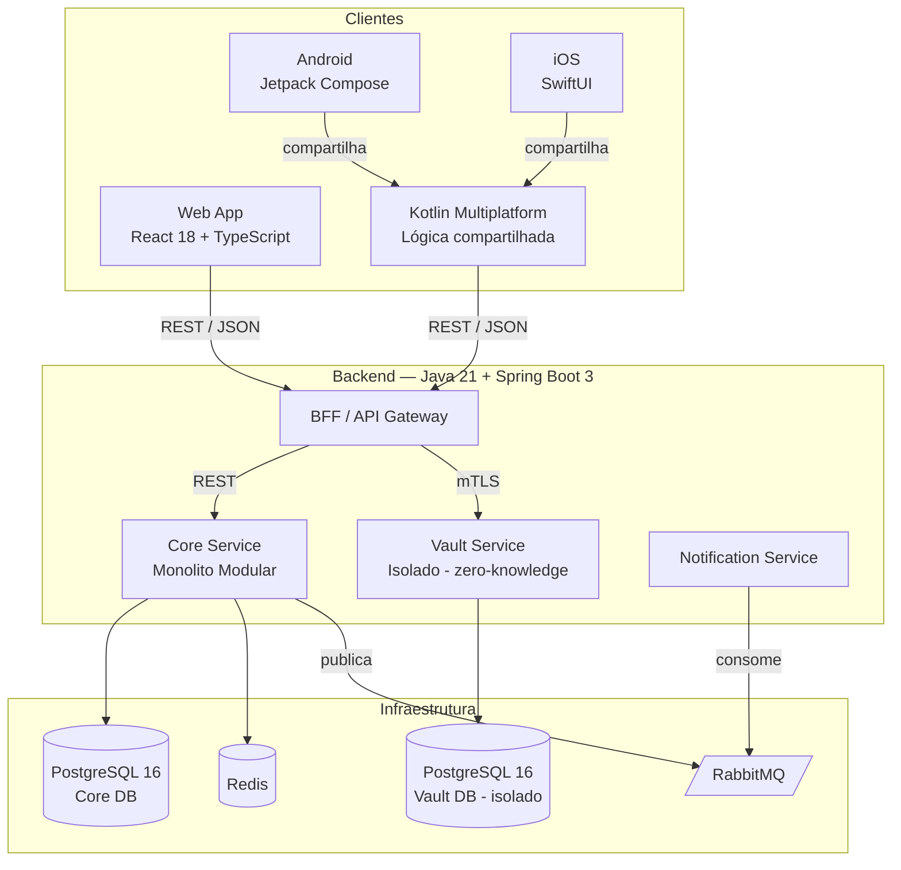

# Neuro-Gen — Architecture Decision Records

**Referência:** `04-arquitetura-visao-geral.md`
Cada ADR é imutável após Aceito. Revisões futuras geram novo ADR referenciando o anterior.

---

## ADR-001: Padrão Arquitetural — Monolito Modular com Vault isolado

**Status:** Aceito

### Contexto
Projeto greenfield, MVP com escopo definido em `02-requisitos-funcionais.md`. Time presumivelmente pequeno/médio nesta fase (sem indicação de múltiplos times independentes). Existe um requisito de segurança não negociável (RNF-SEC.4, RF-08.5): o Cofre não pode compartilhar infraestrutura com o restante do sistema.

### Decisão
Adotar **monolito modular** em Java para o Core do produto (Agenda, Organização, Foco, Regulação Emocional, Permissões/Vínculo), com **Vault Service isolado** como serviço independente desde o MVP. Notification Service também isolado, por ser naturalmente assíncrono e não dever bloquear o Core.

### Alternativas Consideradas
- **Microsserviços completos (um serviço por domínio):** rejeitado nesta fase — complexidade operacional (deploy, observabilidade distribuída, consistência entre serviços) não se justifica para o tamanho de time e volume de usuários do MVP (RNF-ESC.4: 100k MAU alvo, não milhões). Reavaliar quando houver múltiplos times ou necessidade real de escalar módulos de forma independente.
- **Monolito único sem isolar o Vault:** rejeitado — viola diretamente RNF-SEC.4 e RF-08.5, que exigem isolamento de infraestrutura para o Cofre. Não é uma opção viável dado o requisito de segurança, não apenas uma preferência.

### Consequências
Positivas:
- Menor complexidade operacional no MVP — um deployable principal + 2 serviços satélites (Vault, Notification).
- Bounded contexts internos (pacotes Java isolados por módulo) preparam o terreno para extração futura em microsserviços, se necessário.
- Time-to-market mais rápido que microsserviços completos.

Negativas / trade-offs aceitos:
- Risco de acoplamento interno crescer se os bounded contexts não forem respeitados na implementação — mitigação: revisão de arquitetura em code review, sem acesso direto a tabela de outro módulo.
- Escala de módulos individuais (ex: Notification em pico de envio) depende de escalar o Core inteiro, exceto pelos serviços já isolados.

### Referências
`03-requisitos-nao-funcionais.md` (RNF-SEC.4, RNF-ESC.4), `02-requisitos-funcionais.md` (RF-08.5).

---

## ADR-002: Stack de Backend — Java 21 (LTS) + Spring Boot 3 + PostgreSQL + RabbitMQ + Redis

**Status:** Aceito

### Contexto
Constraint de entrada: backend em Java (definição da organização). Necessário decidir versão, framework, banco de dados, mensageria e cache compatíveis com os RNFs de segurança, performance e escalabilidade já definidos.

### Decisão
- **Linguagem/runtime:** Java 21 (LTS), permite uso de virtual threads (Project Loom) — relevante para RNF-PERF sob carga de I/O (chamadas a banco, fila, serviços externos) sem a complexidade de programação reativa completa.
- **Framework:** Spring Boot 3 (Spring Security para auth/autorização, Spring Data JPA para persistência, Spring AMQP para RabbitMQ).
- **Banco de dados:** PostgreSQL 16 — suporte a row-level security (reforço de isolamento Titular/Apoio a nível de banco), criptografia em repouso, maturidade e disponibilidade em qualquer provedor cloud (evita lock-in — ver eixo "Acoplamento a fornecedor").
- **Mensageria:** RabbitMQ — modelo de filas simples o suficiente para o volume de notificações do MVP (RNF-ESC.3), operação mais simples que Kafka.
- **Cache:** Redis — sessão e leitura de alta frequência (dashboard, agenda do dia).

### Alternativas Consideradas
- **Quarkus/Micronaut** (em vez de Spring Boot): rejeitado — Spring Boot tem maior maturidade de ecossistema para os módulos necessários (Security, Data, AMQP) e maior disponibilidade de mão de obra no mercado, reduzindo risco de contratação/ramp-up. Quarkus levaria vantagem em cold start (relevante para serverless), mas a arquitetura não é serverless neste ADR.
- **MongoDB** (em vez de PostgreSQL): rejeitado — dados do Neuro-Gen são majoritariamente relacionais (usuário, vínculo, permissão, agenda, tarefa) com necessidade forte de consistência transacional (ex: alteração de permissão não pode ficar em estado intermediário). Documento não-relacional não traz vantagem clara aqui e perde garantias transacionais nativas.
- **Kafka** (em vez de RabbitMQ): rejeitado nesta fase — Kafka se justifica por altíssimo throughput e replay de eventos; volume de notificações do MVP não exige isso, e a complexidade operacional adicional não se paga ainda. Reavaliar se o produto evoluir para arquitetura orientada a eventos mais ampla.

### Consequências
Positivas:
- Ecossistema maduro, grande disponibilidade de talento Java/Spring no mercado.
- PostgreSQL cobre tanto necessidade transacional quanto features de segurança relevantes (RLS) sem banco adicional.
- Virtual threads (Java 21) melhoram throughput sob I/O-bound sem reescrever para reativo.

Negativas / trade-offs aceitos:
- Spring Boot tem footprint de memória e cold start maiores que alternativas como Quarkus — aceito por não haver requisito serverless/cold-start crítico no backend.
- RabbitMQ exigirá migração futura para Kafka se o volume de eventos crescer muito além do previsto — trade-off consciente de simplicidade agora vs. possível migração depois.

### Referências
`03-requisitos-nao-funcionais.md` (RNF-ESC, RNF-PERF, RNF-MAN).

---

## ADR-003: Stack Mobile — Kotlin Multiplatform (KMM) com UI nativa por plataforma

**Status:** Aceito

### Contexto
Requisito de paridade funcional total entre Android e iOS (RF-09.1–09.3), com forte exigência de acessibilidade nativa (RNF-USA.2: leitor de tela VoiceOver/TalkBack, Dynamic Type) e performance (RNF-PERF.3: cold start < 2s). Constraint organizacional de Java no backend favorece afinidade com a JVM no mobile, mas Java não roda nativamente em iOS.

### Decisão
Adotar **Kotlin Multiplatform Mobile (KMM)** para compartilhar camada de lógica de negócio, modelos de dados e sincronização entre Android e iOS, com **UI 100% nativa por plataforma** (Jetpack Compose no Android, SwiftUI no iOS).

### Alternativas Consideradas
- **Flutter:** rejeitado — engine de renderização própria (Skia) tende a exigir mais trabalho para atingir paridade real com acessibilidade nativa de cada SO (RNF-USA.2) comparado a UI verdadeiramente nativa; também não interopera com o ecossistema Java do backend, perdendo a vantagem de reuso de conhecimento/bibliotecas do time.
- **React Native:** rejeitado — mesma limitação de acessibilidade nativa que Flutter em cenários mais complexos; ecossistema JS distante do Java do backend, exigindo contexto de time adicional (embora o Web já seja React/TS, então há alguma sinergia — ponto considerado, mas não suficiente para superar a vantagem de acessibilidade nativa do KMM+UI nativa).
- **100% nativo separado (Java/Kotlin Android + Swift iOS, sem compartilhamento):** considerado viável e mais simples operacionalmente, mas gera duplicação de lógica de negócio (validações, regras de permissão, sincronização offline) em duas bases de código — risco de divergência de comportamento entre plataformas, especialmente crítico em regras de segurança do Vault (RF-08.5) e permissões (RF-01.3). KMM elimina essa duplicação mantendo UI nativa.

### Consequências
Positivas:
- Lógica de negócio (permissões, validações, sincronização) escrita uma vez, reduzindo risco de divergência de comportamento entre Android e iOS.
- Kotlin interopera nativamente com bibliotecas Java existentes do backend/ecossistema.
- UI nativa preserva acessibilidade e performance no nível exigido pelos RNFs.

Negativas / trade-offs aceitos:
- Equipe precisa de maturidade em Kotlin Multiplatform, tecnologia menos madura que alternativas cross-platform mais estabelecidas (Flutter/RN) — mitigação: PoC na Fase 3 antes de comprometer o roadmap completo (ver `04-arquitetura-visao-geral.md`, seção de riscos).
- Duas UIs mantidas (Compose + SwiftUI) em vez de uma única — mais esforço de UI que Flutter/RN, aceito como custo do requisito de acessibilidade nativa.

### Referências
`03-requisitos-nao-funcionais.md` (RNF-USA.2, RNF-PERF.3, RNF-COMPAT), `02-requisitos-funcionais.md` (RF-09).

---

## ADR-004: Stack Web — React + TypeScript

**Status:** Aceito

### Contexto
Web app responsivo com paridade funcional total (RF-09.1), acessibilidade WCAG 2.1 AA (RNF-USA.2) e forte necessidade de corretude em regras de permissão complexas (RF-01).

### Decisão
React 18+ com TypeScript, gerenciamento de estado via biblioteca leve (ex: Zustand/Redux Toolkit — decisão de detalhe a ser tomada em design doc de frontend), componentes acessíveis via biblioteca com suporte WCAG validado (ex: Radix UI ou equivalente).

### Alternativas Consideradas
- **Angular:** rejeitado — maior verbosidade e curva de aprendizado para o ganho relativo neste contexto; React tem maior disponibilidade de talento e ecossistema de acessibilidade mais amplamente adotado no momento.
- **Vue:** rejeitado — ecossistema menor de componentes acessíveis prontos comparado a React; sem vantagem clara que justifique a troca.

### Consequências
Positivas: disponibilidade de talento, ecossistema maduro de acessibilidade, TypeScript reduz erro de runtime em lógica de permissão.
Negativas / trade-offs aceitos: SPA exige atenção deliberada a SEO/performance de carregamento inicial (RNF-PERF.4) — mitigado com code splitting e lazy loading por rota.

### Referências
`03-requisitos-nao-funcionais.md` (RNF-USA.2, RNF-PERF.4, RNF-COMPAT.1).

---

## ADR-005: Isolamento e Criptografia do Cofre (Vault Service)

**Status:** Aceito

### Contexto
RF-08.2/08.5 e RNF-SEC.3/SEC.4 exigem que o Cofre seja zero-knowledge (servidor nunca vê texto claro) e estruturalmente inacessível a contas de Apoio, independentemente de configuração de permissão em outros módulos.

### Decisão
- Vault Service como aplicação Java/Spring Boot **separada** do Core, com banco PostgreSQL próprio, credenciais de infraestrutura próprias, e comunicação exclusivamente via mTLS a partir do BFF.
- Criptografia client-side: chave derivada da senha mestra via Argon2id no dispositivo do usuário (web/mobile); apenas payload cifrado trafega e é armazenado.
- Autorização do Vault Service **não consulta a matriz de permissões do Core para contas de Apoio** — a rota de acesso ao Vault simplesmente não existe para o papel "Apoio" a nível de contrato de API (hard-coded na camada de autorização, não uma checagem condicional que possa ser mal configurada).

### Alternativas Consideradas
- **Cofre como módulo do monolito Core, com checagem de permissão em runtime:** rejeitado — uma falha de configuração ou bug na checagem de permissão exporia dado de altíssima criticidade. Separação estrutural é defesa em profundidade; erro de configuração em outro módulo não pode afetar o Vault.
- **Criptografia server-side (servidor detém a chave):** rejeitado — não atende zero-knowledge (RNF-SEC.3); comprometimento do servidor exporia todos os segredos armazenados.

### Consequências
Positivas: menor superfície de risco; violação de segurança em outro módulo não compromete o Cofre; alinhado a RF-08.5 de forma estrutural, não apenas por configuração.
Negativas / trade-offs aceitos: recuperação de senha mestra não é possível sem a chave de recuperação gerada no setup (RF-08.11) — trade-off inerente ao zero-knowledge, comunicado explicitamente ao usuário.

### Referências
`02-requisitos-funcionais.md` (RF-08), `03-requisitos-nao-funcionais.md` (RNF-SEC.3, RNF-SEC.4).

---

## ADR-006: Modelagem de Dados Sensíveis — Privacy by Design

**Status:** Aceito

### Contexto
Dado de neurodivergência e estado emocional é dado sensível de saúde sob a LGPD (RNF-PRIV.1). Schema de dados precisa refletir minimização (RNF-PRIV.7) e consentimento granular (RNF-PRIV.3) desde a primeira versão, para evitar retrabalho estrutural.

### Decisão
- Separar, a nível de schema, dados "operacionais" (agenda, tarefa) de dados "sensíveis" (check-in emocional, diário, perfil de neurodivergência) em tabelas/schemas distintos dentro do Core DB, com política de acesso e criptografia de coluna adicional (pgcrypto ou equivalente) aplicada especificamente às tabelas sensíveis.
- Tabela de consentimento (`ConsentRecord`) como fonte única de verdade para o que cada vínculo Titular-Apoio pode acessar — toda leitura de dado sensível por um Apoio passa por checagem contra essa tabela na camada de aplicação, nunca por query direta.
- Campos de perfil de neurodivergência (RF-10.1) armazenados como valor opcional, nunca obrigatório, com flag explícita de "não informado" distinta de ausência de dado (evita inferência indevida).

### Alternativas Consideradas
- **Um único schema sem segregação sensível/operacional:** rejeitado — dificulta auditoria e aplicação de política de acesso diferenciada exigida por RNF-PRIV; qualquer vazamento de configuração afeta indistintamente dado sensível e não sensível.

### Consequências
Positivas: auditoria mais simples (dado sensível fica visivelmente isolado no schema), base pronta para DPIA/RIPD (RNF-PRIV.9).
Negativas / trade-offs aceitos: joins entre schema operacional e sensível adicionam leve complexidade de query — aceito em favor de segurança/compliance.

### Referências
`03-requisitos-nao-funcionais.md` (RNF-PRIV), `02-requisitos-funcionais.md` (RF-05, RF-10).

---

## Resumo da Stack Definida

| Camada | Tecnologia |
|---|---|
| Backend Core | Java 21 + Spring Boot 3 |
| Backend Vault (isolado) | Java 21 + Spring Boot 3, infra separada |
| Backend Notification | Java 21 + Spring Boot 3 |
| Banco de dados | PostgreSQL 16 |
| Cache | Redis |
| Mensageria | RabbitMQ |
| Web | React 18 + TypeScript |
| Mobile | Kotlin Multiplatform (lógica compartilhada) + Jetpack Compose (Android) + SwiftUI (iOS) |
| Padrão arquitetural | Monolito modular (Core) + serviços isolados (Vault, Notification) |
