# Diagrama de Classes — Neuro-Gen

> **Arquitetura:** Clean Architecture + Hexagonal | Monólito Modular  
> **Tech:** Java 21 · Spring Boot 3 · Spring Data JPA · PostgreSQL  
> **Módulos:** `shared` · `identity` · `link` · `agenda` · `focus` · `emotional` · `vault` (serviço isolado)
>
> **Convenções de estereótipos:**
> - `<<aggregate>>` — raiz de consistência, herda `AggregateRoot`
> - `<<valueobject>>` — imutável, sem identidade, validado no construtor
> - `<<record>>` — imutável Java 16+, usado para Commands e DTOs
> - `<<enumeration>>` — tipo fechado de valores do domínio
> - `<<interface>>` — porta de saída (hexagonal), implementada na infra
>
> Camadas por módulo: `domain` → `application` → `api` → `infrastructure`

---

## 1. Shared Kernel

> Base reutilizada por todos os módulos. Nenhum módulo importa de outro —
> apenas do Shared Kernel. Define contratos, abstrações e tratamento
> centralizado de exceções com mapeamento HTTP padronizado.

```mermaid
classDiagram
    direction TB

    %% ============================================================
    %% AggregateRoot — Superclasse de todas as raízes de agregado.
    %% Acumula Domain Events para serem despachados pela camada de
    %% application após a operação de domínio ser persistida.
    %% ============================================================
    class AggregateRoot {
        <<abstract>>
        -List~DomainEvent~ pendingEvents
        +pullDomainEvents() List~DomainEvent~
        #registerEvent(DomainEvent event) void
    }

    %% ============================================================
    %% DomainEvent — Marker interface para eventos de domínio.
    %% Publicados via Spring ApplicationEventPublisher.
    %% Permitem comunicação desacoplada entre módulos internos.
    %% ============================================================
    class DomainEvent {
        <<interface>>
        +UUID eventId
        +Instant occurredAt
        +String aggregateId
        +String moduleName
    }

    %% ============================================================
    %% Value Objects comuns — imutáveis, igualdade por valor.
    %% Lançam ValidationException no construtor se inválidos.
    %% ============================================================
    class UserId {
        <<valueobject>>
        -UUID value
        +UserId(UUID value)
        +UUID value()
        +static UserId generate()
        +static UserId of(String uuidStr)
    }

    class Email {
        <<valueobject>>
        -String value
        +Email(String value)
        +String value()
        %% Valida RFC 5322, normaliza para lowercase
    }

    class AuditMetadata {
        <<valueobject>>
        -Instant createdAt
        -Instant updatedAt
        -String createdBy
        +AuditMetadata touch(String updatedBy) AuditMetadata
        %% Retorna nova instância — imutável
    }

    %% ============================================================
    %% Hierarquia de Exceções — padrão centralizado.
    %% NeuroGenException carrega o código de erro e HttpStatus
    %% para mapeamento automático no GlobalExceptionHandler.
    %% ============================================================
    class NeuroGenException {
        <<abstract>>
        -String errorCode
        -HttpStatus httpStatus
        +NeuroGenException(String errorCode, String message, HttpStatus httpStatus)
        +String getErrorCode()
        +HttpStatus getHttpStatus()
    }

    class DomainException {
        <<abstract>>
        %% Violações das regras de negócio do domínio
        %% HTTP: 400, 404, 409, 410, 422
    }

    class ApplicationException {
        <<abstract>>
        %% Falhas na orquestração dos use cases
        %% HTTP: 500 (nunca deve vazar para o usuário)
    }

    class InfrastructureException {
        <<abstract>>
        %% Falhas em banco, fila, cache ou serviços externos
        %% HTTP: 502 Bad Gateway | 503 Service Unavailable
    }

    class NotFoundException {
        %% HTTP 404 — recurso não existe para este usuário
        +NotFoundException(String resource, String id)
    }

    class ForbiddenAccessException {
        %% HTTP 403 — autenticado mas sem permissão
        %% Ex: Apoio tenta acessar módulo não liberado
        +ForbiddenAccessException(String module, String reason)
    }

    class ValidationException {
        %% HTTP 400 — dados de entrada inválidos
        -Map~String,String~ fieldErrors
        +ValidationException(Map~String,String~ fieldErrors)
        +Map~String,String~ getFieldErrors()
    }

    class ConflictException {
        %% HTTP 409 — estado inconsistente ou recurso duplicado
        +ConflictException(String resource, String detail)
    }

    class GoneException {
        %% HTTP 410 — recurso existia mas foi removido/expirou
        %% Ex: token de convite expirado
    }

    %% ============================================================
    %% ErrorResponse — Record imutável: corpo JSON de toda resposta
    %% de erro da API. Segue RFC 7807 (Problem Details for HTTP APIs).
    %% Produzido exclusivamente pelo GlobalExceptionHandler.
    %% ============================================================
    class ErrorResponse {
        <<record>>
        String timestamp
        int status
        String error
        String code
        String message
        String path
        Map~String,String~ fieldErrors
        +static ErrorResponse of(NeuroGenException ex, HttpServletRequest req) ErrorResponse
    }

    %% ============================================================
    %% PagedResponse — Record genérico para listas paginadas.
    %% Sempre retorna metadados de paginação — nunca array puro.
    %% ============================================================
    class PagedResponse~T~ {
        <<record>>
        List~T~ content
        int page
        int size
        long totalElements
        int totalPages
        boolean last
        +static PagedResponse~T~ from(Page~T~ springPage) PagedResponse~T~
    }

    %% ============================================================
    %% GlobalExceptionHandler — @RestControllerAdvice.
    %% Intercepta toda exceção lançada em qualquer camada e
    %% mapeia para ErrorResponse com o status HTTP correto.
    %% Garante que nenhum stack trace vaze para o cliente.
    %% ============================================================
    class GlobalExceptionHandler {
        +handleDomain(DomainException ex, HttpServletRequest req) ResponseEntity~ErrorResponse~
        +handleValidation(ValidationException ex, HttpServletRequest req) ResponseEntity~ErrorResponse~
        +handleNotFound(NotFoundException ex, HttpServletRequest req) ResponseEntity~ErrorResponse~
        +handleForbidden(ForbiddenAccessException ex, HttpServletRequest req) ResponseEntity~ErrorResponse~
        +handleInfrastructure(InfrastructureException ex, HttpServletRequest req) ResponseEntity~ErrorResponse~
        +handleUnexpected(Exception ex, HttpServletRequest req) ResponseEntity~ErrorResponse~
    }

    NeuroGenException <|-- DomainException
    NeuroGenException <|-- ApplicationException
    NeuroGenException <|-- InfrastructureException
    DomainException <|-- NotFoundException
    DomainException <|-- ForbiddenAccessException
    DomainException <|-- ValidationException
    DomainException <|-- ConflictException
    DomainException <|-- GoneException
    AggregateRoot --> AuditMetadata : contém
    AggregateRoot ..> DomainEvent : publica
    GlobalExceptionHandler ..> ErrorResponse : produz
    GlobalExceptionHandler ..> NeuroGenException : captura
```

---

## 2. Módulo: Identity (IAM)

> Gerencia autenticação, autorização e ciclo de vida de contas.
> Emite JWT (access token curto) + refresh token persistido.
> Suporta credenciais locais e OAuth2 (Google, Apple).
> Senha armazenada apenas como hash Argon2id (RNF-SEC.5).

```mermaid
classDiagram
    direction TB

    %% ============================================================
    %% User — Aggregate Root. Representa a conta do usuário.
    %% Role define se é Titular (dono dos dados) ou Apoio (suporte).
    %% Senha nunca exposta fora do aggregate — apenas o hash.
    %% ============================================================
    class User {
        <<aggregate>>
        -UserId id
        -Email email
        -Password passwordHash
        -UserRole role
        -AccountStatus status
        -boolean emailVerified
        -TotpSecret totpSecret
        -AuditMetadata audit
        +static User register(RegisterUserCommand cmd) User
        +verifyEmail(String token) void
        +changePassword(String currentRaw, String newRaw) void
        +enableTotp(TotpSecret secret) void
        +disableTotp(String totpCode) void
        +suspend(String reason) void
        +requestDeletion() void
        +boolean isActive()
        +boolean requiresTotp()
    }

    %% ============================================================
    %% Password — Value Object para hash de senha.
    %% Usa Argon2id (m=19MB, t=2, p=1 — OWASP).
    %% O texto plano NUNCA é armazenado ou logado.
    %% ============================================================
    class Password {
        <<valueobject>>
        -String argon2Hash
        +static Password hash(String rawPassword) Password
        +boolean matches(String rawPassword) boolean
        %% Lança ValidationException se senha < 8 chars ou sem complexidade
    }

    %% ============================================================
    %% TotpSecret — Value Object para segredo TOTP (2FA).
    %% Armazenado criptografado em repouso (AES-256-GCM).
    %% Verificação do código feita no domínio — não na infra.
    %% ============================================================
    class TotpSecret {
        <<valueobject>>
        -String encryptedBase32Secret
        +TotpSecret(String encryptedBase32Secret)
        +boolean verifyCode(int code)
        +String toOtpAuthUri(String userEmail)
    }

    class UserRole {
        <<enumeration>>
        TITULAR
        %% Dono dos dados — cria vínculos e concede permissões
        APOIO
        %% Acessa dados do Titular conforme permissões concedidas
    }

    class AccountStatus {
        <<enumeration>>
        PENDING_VERIFICATION
        %% Cadastrado, aguardando verificação de e-mail
        ACTIVE
        %% Conta operacional
        SUSPENDED
        %% Suspensa por violação de TOS ou solicitação
        DELETED
        %% Marcada para exclusão (soft-delete, dados anonimizados)
    }

    %% Exceções do módulo Identity — com mapeamento HTTP
    class InvalidCredentialsException {
        %% HTTP 401 — email ou senha incorretos
        %% Mensagem genérica: não revela qual campo está errado
    }
    class AccountAlreadyExistsException {
        %% HTTP 409 — e-mail já cadastrado
    }
    class EmailNotVerifiedException {
        %% HTTP 403 — tentativa de login sem e-mail verificado
    }
    class TokenExpiredException {
        %% HTTP 401 — token de verificação ou reset expirado (TTL 15min)
    }
    class TotpRequiredException {
        %% HTTP 401 com body especial indicando passo 2FA pendente
    }
    class InvalidTotpCodeException {
        %% HTTP 401 — código TOTP inválido ou expirado (30s window)
    }
    class AccountSuspendedException {
        %% HTTP 403 — conta suspensa, não pode autenticar
    }

    %% ============================================================
    %% UserRepository — Porta de saída (hexagonal).
    %% O domínio não conhece JPA — apenas esta interface.
    %% Implementada por UserRepositoryAdapter na camada de infra.
    %% ============================================================
    class UserRepository {
        <<interface>>
        +save(User user) User
        +findById(UserId id) Optional~User~
        +findByEmail(Email email) Optional~User~
        +existsByEmail(Email email) boolean
        +deleteById(UserId id) void
    }

    %% ============================================================
    %% Domain Events — publicados após operações de domínio.
    %% Consumidos por outros módulos via ApplicationEventPublisher.
    %% ============================================================
    class UserRegistered {
        <<record>>
        UUID eventId
        Instant occurredAt
        String aggregateId
        String moduleName
        String userId
        String email
        String role
    }

    class UserEmailVerified {
        <<record>>
        UUID eventId
        Instant occurredAt
        String aggregateId
        String moduleName
        String userId
    }

    %% ============================================================
    %% Command Records — entrada imutável para os Use Cases.
    %% Validados com Bean Validation antes de chegar ao Use Case.
    %% Mapeados a partir dos Request DTOs pelo controller.
    %% ============================================================
    class RegisterUserCommand {
        <<record>>
        String email
        String rawPassword
        String role
    }

    class LoginCommand {
        <<record>>
        String email
        String rawPassword
        String totpCode
        %% totpCode: null se 2FA não ativo
    }

    class VerifyEmailCommand {
        <<record>>
        String userId
        String token
    }

    class ResetPasswordCommand {
        <<record>>
        String resetToken
        String newRawPassword
    }

    %% ============================================================
    %% Result Records — saída imutável dos Use Cases.
    %% NUNCA expõem hash de senha, totpSecret ou tokens internos.
    %% ============================================================
    class UserResult {
        <<record>>
        String id
        String email
        String role
        String status
        boolean emailVerified
        boolean totpEnabled
        String createdAt
    }

    class AuthResult {
        <<record>>
        String accessToken
        %% JWT de curta duração (15min) — stateless, validado pelo gateway
        String refreshToken
        %% Token opaco (30 dias) — persistido em ng_sessions
        long expiresIn
        UserResult user
    }

    %% ============================================================
    %% HTTP Request/Response DTOs — exclusivos da camada de API.
    %% Controller mapeia Request → Command → chama Use Case → Result → Response.
    %% ============================================================
    class RegisterRequest {
        <<record>>
        %% @NotBlank @Email
        String email
        %% @NotBlank @Size(min=8, max=128)
        String password
        %% @NotNull @Pattern(TITULAR|APOIO)
        String role
    }

    class LoginRequest {
        <<record>>
        String email
        String password
        String totpCode
    }

    class TokenResponse {
        <<record>>
        String accessToken
        String refreshToken
        long expiresIn
        String tokenType
        %% tokenType sempre "Bearer"
    }

    class UserProfileResponse {
        <<record>>
        String id
        String email
        String role
        String status
        boolean emailVerified
        boolean totpEnabled
        String createdAt
    }

    %% Relacionamentos
    User *-- Password : passwordHash
    User *-- TotpSecret : totpSecret (nullable)
    User --> UserRole : role
    User --> AccountStatus : status
    User ..> UserRegistered : publica
    User ..> UserEmailVerified : publica
    InvalidCredentialsException --|> DomainException
    AccountAlreadyExistsException --|> ConflictException
    EmailNotVerifiedException --|> ForbiddenAccessException
    TokenExpiredException --|> DomainException
    TotpRequiredException --|> DomainException
    InvalidTotpCodeException --|> DomainException
    AccountSuspendedException --|> ForbiddenAccessException
    UserRegistered ..|> DomainEvent
    UserEmailVerified ..|> DomainEvent
```

---

## 3. Módulo: Link (Vínculo Titular/Apoio)

> Gerencia o relacionamento entre Titular e Apoio.
> Permissões são opt-in: nenhum módulo é visível ao Apoio por padrão.
> Revogação é imediata e invalida sessões ativas do Apoio (RF-01.4).
> O Cofre NUNCA aparece em ModulePermission — restrição hard-coded.

```mermaid
classDiagram
    direction TB

    %% ============================================================
    %% SupportLink — Aggregate Root. Representa o vínculo.
    %% Controla o ciclo de vida do convite e da PermissionMatrix.
    %% Cada alteração de permissão gera novo estado imutável.
    %% ============================================================
    class SupportLink {
        <<aggregate>>
        -LinkId id
        -UserId titularId
        -UserId apoioId
        -InviteToken inviteToken
        -PermissionMatrix permissions
        -LinkStatus status
        -AuditMetadata audit
        +static SupportLink createInvite(UserId titularId) SupportLink
        +accept(UserId apoioId) void
        +revoke() void
        +expire() void
        +grantPermission(ModulePermission module) void
        +revokePermission(ModulePermission module) void
        +boolean hasPermission(ModulePermission module)
        +boolean isActive()
        +boolean isExpired()
    }

    class LinkId {
        <<valueobject>>
        -UUID value
        +static LinkId generate() LinkId
        +UUID value()
    }

    %% ============================================================
    %% InviteToken — Token de convite com TTL de 72 horas (RF-01.2).
    %% Expirado, o Titular deve gerar novo convite — antigo invalidado.
    %% Armazenado como hash no banco (nunca o token em texto claro).
    %% ============================================================
    class InviteToken {
        <<valueobject>>
        -String value
        -Instant expiresAt
        +static InviteToken generate() InviteToken
        +boolean isExpired()
        +String value()
        +String toHash()
        %% toHash: SHA-256 do token — armazenado no banco
    }

    %% ============================================================
    %% PermissionMatrix — Conjunto imutável de módulos liberados.
    %% Cada grant/revoke retorna nova instância (imutabilidade).
    %% Fonte única de verdade para o que Apoio pode acessar.
    %% ============================================================
    class PermissionMatrix {
        <<valueobject>>
        -Set~ModulePermission~ granted
        +static PermissionMatrix empty() PermissionMatrix
        +PermissionMatrix grant(ModulePermission module) PermissionMatrix
        +PermissionMatrix revoke(ModulePermission module) PermissionMatrix
        +boolean has(ModulePermission module) boolean
        +Set~ModulePermission~ grantedModules()
    }

    class LinkStatus {
        <<enumeration>>
        PENDING
        %% Convite enviado, aguardando aceite
        ACTIVE
        %% Vínculo ativo com permissões configuráveis
        REVOKED
        %% Encerrado pelo Titular (RF-01.4)
        EXPIRED
        %% Token de convite não aceito dentro do TTL 72h
    }

    %% ============================================================
    %% ModulePermission — Lista de módulos liberáveis para Apoio.
    %% O Cofre (Vault) NUNCA consta aqui — hard-blocked no backend.
    %% Ausência de permissão explícita = acesso negado (opt-in).
    %% ============================================================
    class ModulePermission {
        <<enumeration>>
        AGENDA
        EMOTIONAL_CHECKIN
        JOURNAL
        FOCUS_HISTORY
        ORGANIZATION
        PROGRESS_REPORTS
        SEND_REMINDERS
        %% VAULT propositalmente ausente — RF-08.5
    }

    %% Eventos de domínio do módulo Link
    class LinkCreated {
        <<record>>
        UUID eventId
        Instant occurredAt
        String aggregateId
        String moduleName
        String linkId
        String titularId
    }

    class LinkRevoked {
        <<record>>
        UUID eventId
        Instant occurredAt
        String aggregateId
        String moduleName
        String linkId
        String titularId
        String apoioId
        %% Consumido pelo módulo Identity para invalidar sessões do Apoio
    }

    %% Exceções
    class InviteExpiredException {
        %% HTTP 410 Gone — convite expirou (> 72h)
    }
    class InviteAlreadyUsedException {
        %% HTTP 409 Conflict — convite já foi aceito anteriormente
    }
    class LinkAlreadyRevokedException {
        %% HTTP 409 Conflict — vínculo já foi revogado
    }
    class InsufficientPermissionException {
        %% HTTP 403 Forbidden — Apoio acessa módulo não liberado
        -ModulePermission requiredModule
        +InsufficientPermissionException(ModulePermission module)
    }

    %% Porta de saída
    class SupportLinkRepository {
        <<interface>>
        +save(SupportLink link) SupportLink
        +findById(LinkId id) Optional~SupportLink~
        +findByTokenHash(String hash) Optional~SupportLink~
        +findActiveByTitularId(UserId titularId) List~SupportLink~
        +findActiveByApoioId(UserId apoioId) List~SupportLink~
        +revokeAllByTitularId(UserId titularId) void
    }

    %% Commands
    class CreateInviteCommand {
        <<record>>
        String titularId
    }

    class AcceptInviteCommand {
        <<record>>
        String rawInviteToken
        String apoioId
    }

    class UpdatePermissionsCommand {
        <<record>>
        String linkId
        String titularId
        Set~String~ modulesToGrant
        Set~String~ modulesToRevoke
    }

    %% Results
    class LinkResult {
        <<record>>
        String id
        String titularId
        String apoioId
        String apoioEmail
        String status
        Set~String~ grantedPermissions
        String createdAt
    }

    %% HTTP DTOs
    class InviteResponse {
        <<record>>
        String linkId
        String inviteToken
        String inviteUrl
        String expiresAt
        %% inviteUrl: deeplink para aceite no app
    }

    class LinkResponse {
        <<record>>
        String id
        String apoioEmail
        String status
        Set~String~ permissions
        String linkedAt
    }

    class UpdatePermissionsRequest {
        <<record>>
        %% @NotNull — ao menos um dos dois deve ser não-vazio
        Set~String~ grant
        Set~String~ revoke
    }

    SupportLink *-- LinkId
    SupportLink *-- InviteToken
    SupportLink *-- PermissionMatrix
    SupportLink --> LinkStatus
    PermissionMatrix --> ModulePermission
    SupportLink ..> LinkCreated : publica
    SupportLink ..> LinkRevoked : publica
    InviteExpiredException --|> GoneException
    InviteAlreadyUsedException --|> ConflictException
    LinkAlreadyRevokedException --|> ConflictException
    InsufficientPermissionException --|> ForbiddenAccessException
    LinkCreated ..|> DomainEvent
    LinkRevoked ..|> DomainEvent
```

---

## 4. Módulo: Agenda

> Eventos (compromissos com hora fixa) e Tarefas (atividades flexíveis).
> Suporta recorrência RRULE (RFC 5545), lembretes persistentes (nudge),
> subtarefas, categorias e drag-and-drop entre visões.

```mermaid
classDiagram
    direction TB

    %% ============================================================
    %% Event — Aggregate Root para compromissos com hora fixa.
    %% Recorrência editada sempre pergunta o scope ao usuário (RF-02).
    %% ============================================================
    class Event {
        <<aggregate>>
        -EventId id
        -UserId ownerId
        -String title
        -String description
        -TimeRange timeRange
        -EventType type
        -RRule recurrenceRule
        -List~Reminder~ reminders
        -CategoryId categoryId
        -boolean sharedWithSupport
        -AuditMetadata audit
        +static Event create(CreateEventCommand cmd) Event
        +reschedule(TimeRange newRange, RecurrenceEditScope scope) void
        +cancel(RecurrenceEditScope scope) void
        +addReminder(Reminder reminder) void
        +removeReminder(UUID reminderId) void
    }

    %% ============================================================
    %% Task — Aggregate Root para tarefas sem horário fixo.
    %% Calcula completionPercentage baseado nas subtarefas filhas.
    %% ============================================================
    class Task {
        <<aggregate>>
        -TaskId id
        -UserId ownerId
        -String title
        -String description
        -TaskStatus status
        -Priority priority
        -LocalDate dueDate
        -List~Subtask~ subtasks
        -List~Reminder~ reminders
        -CategoryId categoryId
        -boolean sharedWithSupport
        -AuditMetadata audit
        +static Task create(CreateTaskCommand cmd) Task
        +complete() void
        +archive() void
        +reopen() void
        +addSubtask(String title) void
        +completeSubtask(UUID subtaskId) void
        +int completionPercentage()
        %% completionPercentage = (subtarefas done / total) * 100
    }

    %% ============================================================
    %% Subtask — Entidade filha de Task (não é aggregate próprio).
    %% Consistência gerenciada pela Task-mãe.
    %% ============================================================
    class Subtask {
        -UUID id
        -String title
        -boolean done
        -int position
        +complete() void
        +reopen() void
        +reorder(int newPosition) void
    }

    %% ============================================================
    %% Reminder — Entidade de lembrete vinculada a Event ou Task.
    %% Nudge: repete a cada repeatIntervalMinutes até maxRepetitions
    %% ou até confirmação de leitura (RF-03.2).
    %% ============================================================
    class Reminder {
        -UUID id
        -ReminderTrigger trigger
        -boolean persistent
        -int repeatIntervalMinutes
        -int maxRepetitions
        -int currentRepetitions
        -ReminderStatus status
        -Instant nextFireAt
        +schedule(Instant baseTime) void
        +confirm(Instant confirmedAt) void
        +markSent() void
        +boolean shouldRepeat()
        %% shouldRepeat: persistent && currentRepetitions < maxRepetitions
    }

    %% ============================================================
    %% TimeRange — intervalo de tempo validado (start < end).
    %% ============================================================
    class TimeRange {
        <<valueobject>>
        -Instant start
        -Instant end
        +TimeRange(Instant start, Instant end)
        +Duration duration()
        +boolean overlaps(TimeRange other)
        +boolean isInFuture()
    }

    %% ============================================================
    %% RRule — Regra de recorrência RFC 5545 (ex: FREQ=WEEKLY;BYDAY=MO).
    %% Lança InvalidRecurrenceRuleException se string malformada.
    %% ============================================================
    class RRule {
        <<valueobject>>
        -String rfc5545String
        +RRule(String rfc5545String)
        +List~Instant~ nextOccurrences(Instant from, int count)
        +boolean hasEndDate()
    }

    %% ============================================================
    %% ReminderTrigger — offset relativo em minutos antes do evento.
    %% ============================================================
    class ReminderTrigger {
        <<valueobject>>
        -int minutesBefore
        +ReminderTrigger(int minutesBefore)
        +Instant resolveFor(Instant eventTime)
    }

    class EventId {
        <<valueobject>>
        -UUID value
        +static EventId generate() EventId
    }

    class TaskId {
        <<valueobject>>
        -UUID value
        +static TaskId generate() TaskId
    }

    class CategoryId {
        <<valueobject>>
        -UUID value
        +static CategoryId of(String id) CategoryId
    }

    class TaskStatus {
        <<enumeration>>
        PENDING
        IN_PROGRESS
        DONE
        ARCHIVED
    }

    class Priority {
        <<enumeration>>
        LOW
        MEDIUM
        HIGH
        CRITICAL
    }

    class EventType {
        <<enumeration>>
        APPOINTMENT
        %% Compromisso externo (consulta, reunião)
        PERSONAL
        %% Bloco pessoal (time-blocking)
        ROUTINE
        %% Gerado a partir de RoutineTemplate
    }

    class ReminderStatus {
        <<enumeration>>
        SCHEDULED
        %% Agendado, ainda não disparado
        SENT
        %% Enviado, aguardando confirmação
        CONFIRMED
        %% Usuário leu e confirmou
        EXPIRED
        %% Passou do horário sem ser enviado
        UNCONFIRMED_LIMIT_REACHED
        %% Nudge atingiu maxRepetitions sem confirmação
    }

    %% ============================================================
    %% RecurrenceEditScope — Obrigatório ao editar item recorrente.
    %% O sistema SEMPRE pergunta ao usuário antes de aplicar (RF-02).
    %% ============================================================
    class RecurrenceEditScope {
        <<enumeration>>
        THIS_OCCURRENCE
        THIS_AND_FUTURE
        ALL_OCCURRENCES
    }

    %% Exceções do módulo Agenda
    class EventNotFoundException {
        %% HTTP 404
    }
    class TaskNotFoundException {
        %% HTTP 404
    }
    class InvalidRecurrenceRuleException {
        %% HTTP 400 — RRULE malformada
        -String invalidRule
    }

    %% Portas de saída
    class EventRepository {
        <<interface>>
        +save(Event event) Event
        +findById(EventId id) Optional~Event~
        +findByOwnerAndPeriod(UserId owner, Instant from, Instant to) List~Event~
        +delete(EventId id) void
    }

    class TaskRepository {
        <<interface>>
        +save(Task task) Task
        +findById(TaskId id) Optional~Task~
        +findByOwnerAndStatus(UserId owner, TaskStatus status) List~Task~
        +delete(TaskId id) void
    }

    %% Commands
    class CreateEventCommand {
        <<record>>
        String ownerId
        String title
        String description
        Instant startAt
        Instant endAt
        String rrule
        String categoryId
        boolean sharedWithSupport
        List~CreateReminderCommand~ reminders
    }

    class CreateTaskCommand {
        <<record>>
        String ownerId
        String title
        String description
        String priority
        LocalDate dueDate
        String categoryId
        List~CreateReminderCommand~ reminders
    }

    class CreateReminderCommand {
        <<record>>
        int minutesBefore
        boolean persistent
        int repeatIntervalMinutes
        int maxRepetitions
    }

    %% Results
    class EventResult {
        <<record>>
        String id
        String title
        String startAt
        String endAt
        String eventType
        String rrule
        String categoryId
        boolean sharedWithSupport
        List~ReminderResult~ reminders
    }

    class TaskResult {
        <<record>>
        String id
        String title
        String status
        String priority
        String dueDate
        int completionPercentage
        List~SubtaskResult~ subtasks
        List~ReminderResult~ reminders
    }

    class ReminderResult {
        <<record>>
        String id
        int minutesBefore
        boolean persistent
        String status
    }

    class SubtaskResult {
        <<record>>
        String id
        String title
        boolean done
        int position
    }

    %% HTTP DTOs
    class CreateEventRequest {
        <<record>>
        String title
        String description
        %% @NotBlank @Size(max=200)
        String startAt
        String endAt
        String rrule
        String categoryId
        boolean sharedWithSupport
        List~ReminderRequest~ reminders
    }

    class EventResponse {
        <<record>>
        String id
        String title
        String startAt
        String endAt
        String eventType
        String recurrence
        String categoryName
        boolean sharedWithSupport
        List~ReminderResponse~ reminders
    }

    class TaskResponse {
        <<record>>
        String id
        String title
        String status
        String priority
        String dueDate
        int completionPercentage
        List~SubtaskResponse~ subtasks
        List~ReminderResponse~ reminders
    }

    class ReminderRequest {
        <<record>>
        int minutesBefore
        boolean persistent
        int repeatIntervalMinutes
        int maxRepetitions
    }

    class ReminderResponse {
        <<record>>
        String id
        int minutesBefore
        boolean persistent
        String status
    }

    class SubtaskResponse {
        <<record>>
        String id
        String title
        boolean done
        int position
    }

    Event *-- TimeRange
    Event *-- RRule : recurrenceRule (nullable)
    Event *-- Reminder : 0..*
    Event *-- EventId
    Event *-- CategoryId
    Task *-- Subtask : 0..*
    Task *-- Reminder : 0..*
    Task *-- TaskId
    Task *-- CategoryId
    Reminder *-- ReminderTrigger
    Reminder --> ReminderStatus
    Task --> TaskStatus
    Task --> Priority
    Event --> EventType
    EventNotFoundException --|> NotFoundException
    TaskNotFoundException --|> NotFoundException
    InvalidRecurrenceRuleException --|> DomainException
```

---

## 5. Módulo: Focus (Foco e Produtividade)

> Sessões de foco adaptadas (Pomodoro configurável — RF-04).
> Silencia notificações não críticas durante a sessão ativa (RF-04.2).
> Permite pausar/retomar sem perder tempo acumulado (RF-04.8).

```mermaid
classDiagram
    direction TB

    %% ============================================================
    %% FocusSession — Aggregate Root. Controla o ciclo de uma sessão.
    %% effectiveTime = tempo total - soma das pausas.
    %% Ao iniciar, publica FocusSessionStarted para o módulo de
    %% notificações suprimir alertas não críticos.
    %% ============================================================
    class FocusSession {
        <<aggregate>>
        -FocusSessionId id
        -UserId userId
        -TaskId linkedTaskId
        -int plannedMinutes
        -int breakMinutes
        -Instant startedAt
        -Instant endedAt
        -long accumulatedSeconds
        -SessionStatus status
        -List~PauseRecord~ pauses
        -AuditMetadata audit
        +static FocusSession start(StartFocusSessionCommand cmd) FocusSession
        +pause() void
        +resume() void
        +complete() void
        +cancel() void
        +Duration effectiveTime()
        %% effectiveTime = accumulatedSeconds - soma(PauseRecord.duration)
    }

    %% ============================================================
    %% PauseRecord — Value Object imutável de uma pausa.
    %% Criado ao pausar (resumedAt = null) e completado ao retomar.
    %% ============================================================
    class PauseRecord {
        <<valueobject>>
        -Instant pausedAt
        -Instant resumedAt
        +static PauseRecord start(Instant pausedAt) PauseRecord
        +PauseRecord end(Instant resumedAt) PauseRecord
        +Duration pauseDuration()
        +boolean isActive()
        %% isActive: resumedAt == null
    }

    class FocusSessionId {
        <<valueobject>>
        -UUID value
        +static FocusSessionId generate() FocusSessionId
    }

    class SessionStatus {
        <<enumeration>>
        RUNNING
        %% Sessão ativa — notificações suprimidas
        PAUSED
        %% Pausada — notificações normais
        COMPLETED
        %% Finalizada pelo usuário dentro do tempo planejado
        CANCELLED
        %% Cancelada antes de completar
    }

    %% Eventos de domínio
    class FocusSessionStarted {
        <<record>>
        UUID eventId
        Instant occurredAt
        String aggregateId
        String moduleName
        String sessionId
        String userId
        %% Consumido pelo módulo de notificações para suprimir alertas
    }

    class FocusSessionEnded {
        <<record>>
        UUID eventId
        Instant occurredAt
        String aggregateId
        String moduleName
        String sessionId
        String userId
        String finalStatus
        %% Consumido para retomar notificações normais
    }

    %% Exceções
    class SessionAlreadyActiveException {
        %% HTTP 409 — usuário já tem sessão RUNNING
    }
    class SessionNotActiveException {
        %% HTTP 422 — tentativa de pausar/completar sessão não RUNNING
    }

    %% Porta de saída
    class FocusSessionRepository {
        <<interface>>
        +save(FocusSession session) FocusSession
        +findById(FocusSessionId id) Optional~FocusSession~
        +findActiveByUserId(UserId userId) Optional~FocusSession~
        +findByUserIdAndPeriod(UserId userId, Instant from, Instant to) List~FocusSession~
    }

    %% Commands e Results
    class StartFocusSessionCommand {
        <<record>>
        String userId
        String linkedTaskId
        int plannedMinutes
        int breakMinutes
    }

    class FocusSessionResult {
        <<record>>
        String id
        String linkedTaskId
        String linkedTaskTitle
        int plannedMinutes
        String status
        long effectiveSeconds
        String startedAt
        String endedAt
    }

    class StartFocusRequest {
        <<record>>
        String taskId
        %% @Min(1) @Max(480)
        int durationMinutes
        %% @Min(1) @Max(60)
        int breakMinutes
    }

    class FocusSessionResponse {
        <<record>>
        String id
        String status
        int plannedMinutes
        long effectiveSeconds
        String linkedTaskTitle
        String startedAt
    }

    FocusSession *-- PauseRecord : 0..*
    FocusSession *-- FocusSessionId
    FocusSession --> SessionStatus
    FocusSession ..> FocusSessionStarted : publica
    FocusSession ..> FocusSessionEnded : publica
    SessionAlreadyActiveException --|> ConflictException
    SessionNotActiveException --|> DomainException
    FocusSessionStarted ..|> DomainEvent
    FocusSessionEnded ..|> DomainEvent
```

---

## 6. Módulo: Emotional (Regulação Emocional)

> **Dados sensíveis de saúde — LGPD art. 5º, II.**
> Armazenados em schema `ng_sensitive` com criptografia de coluna (pgcrypto).
> Acesso por Apoio exige permissão EMOTIONAL_CHECKIN ou JOURNAL (RF-01.3).
> O produto NUNCA realiza diagnóstico clínico (RF-05, RNF-PRIV.1).

```mermaid
classDiagram
    direction TB

    %% ============================================================
    %% MoodCheckIn — Aggregate Root para check-in de humor/energia.
    %% Preenchimento em < 10s (RF-05.1): escala visual 1-5 + nota.
    %% Configurável: 1x/dia ou múltiplas vezes (RF-05.2).
    %% ============================================================
    class MoodCheckIn {
        <<aggregate>>
        -MoodCheckInId id
        -UserId userId
        -MoodScore moodScore
        -EnergyLevel energyLevel
        -LocalDate checkInDate
        -LocalTime checkInTime
        -String notes
        -AuditMetadata audit
        +static MoodCheckIn record(SubmitMoodCheckInCommand cmd) MoodCheckIn
        +boolean isBelowThreshold(int threshold)
        +MoodLevel moodLevel()
        %% Dado sensível: notes cifrado em repouso (pgcrypto)
    }

    %% ============================================================
    %% JournalEntry — Diário emocional textual opcional (RF-05.3).
    %% Pode ser vinculado a um MoodCheckIn ou criado independente.
    %% content cifrado em repouso — nunca indexado para full-text.
    %% ============================================================
    class JournalEntry {
        <<aggregate>>
        -JournalEntryId id
        -UserId userId
        -String content
        -MoodCheckInId relatedCheckInId
        -LocalDate entryDate
        -AuditMetadata audit
        +static JournalEntry write(WriteJournalCommand cmd) JournalEntry
        +edit(String newContent) void
        %% content armazenado cifrado (pgcrypto AES-256-GCM)
    }

    %% ============================================================
    %% MoodScore — VO para pontuação de humor (1-5).
    %% Lança ValidationException se fora do intervalo.
    %% ============================================================
    class MoodScore {
        <<valueobject>>
        -int value
        +MoodScore(int value)
        +int value()
        +MoodLevel toLevel()
        %% 1=VERY_LOW, 2=LOW, 3=NEUTRAL, 4=HIGH, 5=VERY_HIGH
    }

    class EnergyLevel {
        <<valueobject>>
        -int value
        +EnergyLevel(int value)
        %% Mesma escala de MoodScore (1-5)
        +int value()
    }

    class MoodCheckInId {
        <<valueobject>>
        -UUID value
        +static MoodCheckInId generate() MoodCheckInId
    }

    class JournalEntryId {
        <<valueobject>>
        -UUID value
        +static JournalEntryId generate() JournalEntryId
    }

    %% ============================================================
    %% MoodLevel — Enum derivado do MoodScore. Usado em dashboards
    %% e alertas (RF-05.6). Apresentado como "padrão observado",
    %% NUNCA como diagnóstico ou recomendação médica (RF-05).
    %% ============================================================
    class MoodLevel {
        <<enumeration>>
        VERY_LOW
        LOW
        NEUTRAL
        HIGH
        VERY_HIGH
    }

    %% Exceções
    class EmotionalDataForbiddenException {
        %% HTTP 403 — Apoio sem permissão EMOTIONAL_CHECKIN ou JOURNAL
    }
    class CheckInAlreadyTodayException {
        %% HTTP 409 — quando configurado para 1x/dia e já existe
    }

    %% Portas de saída
    class MoodCheckInRepository {
        <<interface>>
        +save(MoodCheckIn checkIn) MoodCheckIn
        +findById(MoodCheckInId id) Optional~MoodCheckIn~
        +findByUserAndPeriod(UserId userId, LocalDate from, LocalDate to) List~MoodCheckIn~
        +findTodayByUserId(UserId userId) Optional~MoodCheckIn~
    }

    %% Commands
    class SubmitMoodCheckInCommand {
        <<record>>
        String userId
        int moodScore
        int energyLevel
        String notes
    }

    class WriteJournalCommand {
        <<record>>
        String userId
        String content
        String relatedCheckInId
    }

    %% Results
    class MoodCheckInResult {
        <<record>>
        String id
        int moodScore
        int energyLevel
        String moodLevel
        String checkInDate
        String checkInTime
        String notes
    }

    class MoodTrendResult {
        <<record>>
        List~MoodCheckInResult~ dataPoints
        double averageMood
        double averageEnergy
        int periodDays
        String trend
        %% trend: IMPROVING | STABLE | DECLINING
        %% Apresentado como "padrão observado" — sem diagnóstico
    }

    %% HTTP DTOs
    class MoodCheckInRequest {
        <<record>>
        %% @Min(1) @Max(5)
        int moodScore
        %% @Min(1) @Max(5)
        int energyLevel
        %% @Size(max=500)
        String notes
    }

    class MoodCheckInResponse {
        <<record>>
        String id
        int moodScore
        String moodLevel
        int energyLevel
        String checkedAt
    }

    class MoodTrendResponse {
        <<record>>
        List~MoodCheckInResponse~ dataPoints
        double averageMood
        double averageEnergy
        int periodDays
        String trend
        String disclaimer
        %% disclaimer: texto obrigatório informando que não é diagnóstico
    }

    MoodCheckIn *-- MoodScore
    MoodCheckIn *-- EnergyLevel
    MoodCheckIn *-- MoodCheckInId
    JournalEntry *-- JournalEntryId
    MoodScore --> MoodLevel
    EmotionalDataForbiddenException --|> ForbiddenAccessException
    CheckInAlreadyTodayException --|> ConflictException
```

---

## 7. Vault Service (Serviço Isolado — Zero-Knowledge)

> **Serviço Java separado** com banco PostgreSQL próprio e credenciais isoladas.
> Comunicação exclusiva via mTLS a partir do BFF (ADR-005).
> O servidor NUNCA vê texto claro — apenas payload cifrado (RNF-SEC.3).
> Nenhuma conta de Apoio tem rota de acesso — restrição hard-coded (RF-08.5).

```mermaid
classDiagram
    direction TB

    %% ============================================================
    %% VaultEntry — Aggregate Root. Contém apenas dado cifrado.
    %% O servidor armazena e devolve ciphertext — não pode ler.
    %% Decriptação acontece exclusivamente no cliente.
    %% ============================================================
    class VaultEntry {
        <<aggregate>>
        -VaultEntryId id
        -UserId ownerId
        -String label
        -EncryptedPayload payload
        -VaultEntryType entryType
        -AuditMetadata audit
        +static VaultEntry create(CreateVaultEntryCommand cmd) VaultEntry
        +update(String label, EncryptedPayload newPayload) void
        +delete() void
    }

    %% ============================================================
    %% EncryptedPayload — VO para conteúdo cifrado AES-256-GCM.
    %% Chave derivada via Argon2id no CLIENTE (nunca no servidor).
    %% ciphertext: bytes cifrados | iv: nonce | salt: para derivação
    %% ============================================================
    class EncryptedPayload {
        <<valueobject>>
        -byte[] ciphertext
        -byte[] iv
        -byte[] salt
        +EncryptedPayload(byte[] ciphertext, byte[] iv, byte[] salt)
        +String toBase64Json()
        +static EncryptedPayload fromBase64Json(String json) EncryptedPayload
        %% Nunca processa o conteúdo — apenas transporta bytes
    }

    %% ============================================================
    %% MasterKeyMeta — Parâmetros Argon2id para derivação de chave.
    %% Armazena APENAS os parâmetros e hash da chave de recuperação.
    %% NUNCA armazena a chave derivada ou a senha mestra.
    %% recoveryKeyHash: SHA-256(chave de recuperação) para verificação
    %% ============================================================
    class MasterKeyMeta {
        <<valueobject>>
        -String argon2Params
        -String recoveryKeyHash
        -Instant configuredAt
        +boolean verifyRecoveryKey(String providedKey) boolean
        %% verifyRecoveryKey: compara SHA-256(providedKey) == recoveryKeyHash
    }

    class VaultEntryId {
        <<valueobject>>
        -UUID value
        +static VaultEntryId generate() VaultEntryId
    }

    class VaultEntryType {
        <<enumeration>>
        LOGIN_CREDENTIAL
        %% Login + senha + URL
        SECURE_NOTE
        %% Texto livre
        CREDIT_CARD
        %% Dados de cartão cifrados
        API_KEY
        %% Chave de API ou token de serviço
        CUSTOM
        %% Campos customizáveis pelo usuário
    }

    %% Exceções do Vault Service
    class VaultSessionExpiredException {
        %% HTTP 401 — sessão do Cofre expirou (auto-lock após 5min RF-08.6)
        %% Requer nova autenticação com senha mestra
    }
    class InvalidMasterKeyException {
        %% HTTP 401 — senha mestra incorreta
        %% Contabiliza tentativas (rate limit — RNF-SEC.6)
    }
    class VaultEntryNotFoundException {
        %% HTTP 404
    }
    class ApoioVaultAccessAttemptException {
        %% HTTP 403 — tentativa de acesso ao Vault por conta Apoio
        %% SEMPRE registrada em log de segurança (RNF-SEC.8)
        %% Indica ataque ou bug grave — não deve ocorrer em operação normal
    }
    class RecoveryKeyInvalidException {
        %% HTTP 401 — chave de recuperação não confere (RF-08.11)
    }

    %% Porta de saída
    class VaultRepository {
        <<interface>>
        +save(VaultEntry entry) VaultEntry
        +findById(VaultEntryId id) Optional~VaultEntry~
        +findByOwnerId(UserId ownerId) List~VaultEntry~
        +delete(VaultEntryId id) void
        +deleteAllByOwnerId(UserId ownerId) void
        %% deleteAll: exclusão imediata e irreversível na deleção de conta (RNF-RET.2)
    }

    %% Commands
    class OpenVaultCommand {
        <<record>>
        String userId
        String masterPasswordHash
        %% masterPasswordHash: derivado com Argon2id NO CLIENTE
        %% Servidor nunca vê a senha mestra em texto plano
    }

    class CreateVaultEntryCommand {
        <<record>>
        String userId
        String label
        String encryptedPayloadBase64Json
        %% Payload já cifrado no cliente — servidor armazena opaquely
        String entryType
    }

    class RecoverVaultCommand {
        <<record>>
        String userId
        String recoveryKey
        %% Exibida UMA ÚNICA VEZ no setup (RF-08.11)
        String newMasterPasswordHash
    }

    %% Results
    class VaultEntryResult {
        <<record>>
        String id
        String label
        String entryType
        String encryptedPayloadBase64Json
        %% Cliente decifra localmente — servidor não interpreta
        String createdAt
        String updatedAt
    }

    class VaultSessionResult {
        <<record>>
        String vaultSessionToken
        long expiresIn
        %% Token de curta duração para operações no Cofre
        %% Auto-lock após expiresIn segundos de inatividade (RF-08.6)
    }

    %% HTTP DTOs
    class OpenVaultRequest {
        <<record>>
        String masterPasswordHash
        %% Derivado com Argon2id no cliente antes de enviar
    }

    class VaultSessionResponse {
        <<record>>
        String vaultSessionToken
        long expiresInSeconds
    }

    class VaultEntryResponse {
        <<record>>
        String id
        String label
        String entryType
        String encryptedPayload
        String updatedAt
    }

    VaultEntry *-- EncryptedPayload
    VaultEntry *-- VaultEntryId
    VaultEntry --> VaultEntryType
    VaultSessionExpiredException --|> DomainException
    InvalidMasterKeyException --|> DomainException
    VaultEntryNotFoundException --|> NotFoundException
    ApoioVaultAccessAttemptException --|> ForbiddenAccessException
    RecoveryKeyInvalidException --|> DomainException
```

