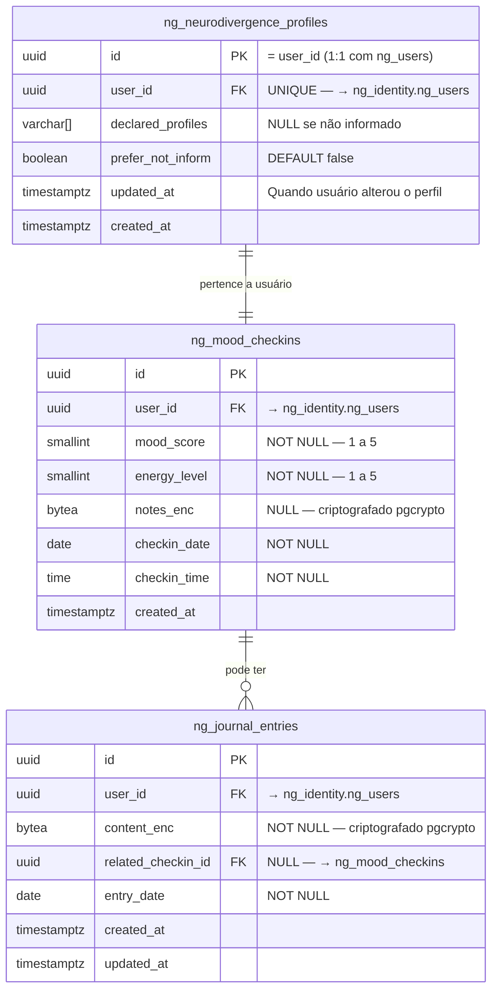
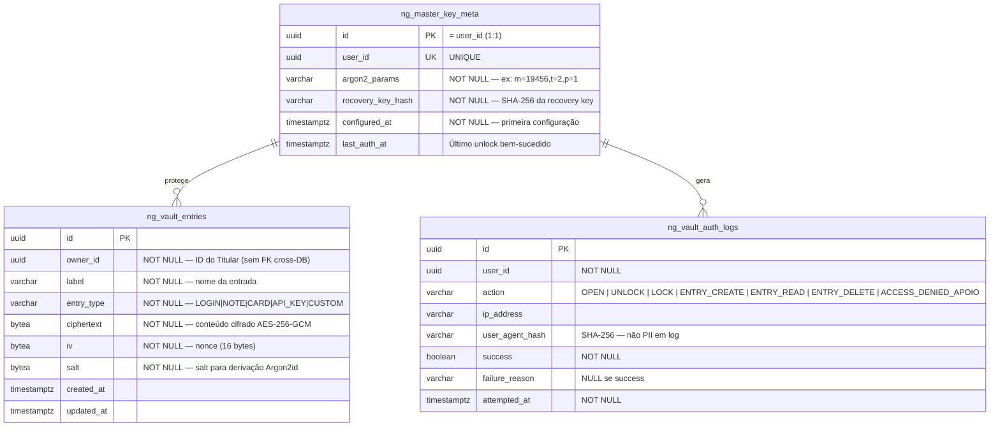

# Diagrama Entidade-Relacionamento (DER) — Neuro-Gen

> **Banco:** PostgreSQL 16  
> **Estratégia:** Schemas separados por sensibilidade de dado (ADR-006)  
> **Nomenclatura:** `ng_<schema>_<entidade>` (ex: `ng_core_events`)  
> **Vault:** Banco PostgreSQL completamente separado (ADR-005)
>
> **Schemas:**
> - `ng_identity` — autenticação, sessões, auditoria de acesso
> - `ng_core` — dados operacionais (agenda, tarefas, vínculos, foco)
> - `ng_sensitive` — dados sensíveis de saúde LGPD (humor, diário, perfil)
> - `ng_vault` *(banco separado)* — cofre zero-knowledge
>
> Todas as tabelas possuem: `created_at TIMESTAMPTZ NOT NULL DEFAULT NOW()`  
> Tabelas mutáveis possuem: `updated_at TIMESTAMPTZ NOT NULL DEFAULT NOW()`

---

## Schema: ng_identity

> Dados de autenticação e controle de conta.
> Colunas de senha e tokens armazenadas como hash (nunca texto claro).

```mermaid
erDiagram

    %% ============================================================
    %% ng_users — Tabela central de contas.
    %% password_hash: Argon2id (RNF-SEC.5)
    %% role: TITULAR | APOIO
    %% status: PENDING_VERIFICATION | ACTIVE | SUSPENDED | DELETED
    %% ============================================================
    ng_users {
        uuid id PK
        varchar email UK "NOT NULL — normalizado para lowercase"
        varchar password_hash "NOT NULL — Argon2id"
        varchar role "NOT NULL — TITULAR | APOIO"
        varchar status "NOT NULL — DEFAULT PENDING_VERIFICATION"
        boolean email_verified "NOT NULL — DEFAULT false"
        boolean totp_enabled "NOT NULL — DEFAULT false"
        timestamptz created_at
        timestamptz updated_at
        timestamptz deleted_at "NULL se conta ativa"
    }

    %% ============================================================
    %% ng_sessions — Refresh tokens persistidos.
    %% access_token é JWT stateless (não persistido).
    %% refresh_token_hash: SHA-256 do token opaco (nunca o token).
    %% ============================================================
    ng_sessions {
        uuid id PK
        uuid user_id FK
        varchar refresh_token_hash UK "SHA-256 do token"
        timestamptz expires_at "NOT NULL"
        varchar device_info "User-Agent + IP hash"
        timestamptz created_at
        timestamptz revoked_at "NULL se ativa"
    }

    %% ============================================================
    %% ng_email_verifications — Tokens de verificação de e-mail.
    %% TTL: 24h. Invalidado após uso (used_at NOT NULL).
    %% ============================================================
    ng_email_verifications {
        uuid id PK
        uuid user_id FK
        varchar token_hash UK "SHA-256 do token enviado por e-mail"
        timestamptz expires_at "NOT NULL"
        timestamptz used_at "NULL se não usado"
        timestamptz created_at
    }

    %% ============================================================
    %% ng_password_resets — Tokens de redefinição de senha.
    %% TTL: 15 minutos (RF-01.7). Invalidado após uso único.
    %% ============================================================
    ng_password_resets {
        uuid id PK
        uuid user_id FK
        varchar token_hash UK "SHA-256 do token"
        timestamptz expires_at "NOT NULL"
        timestamptz used_at "NULL se não usado"
        timestamptz created_at
    }

    %% ============================================================
    %% ng_totp_secrets — Segredo TOTP para 2FA (RF-01.9).
    %% Armazenado criptografado em repouso (AES-256-GCM).
    %% Um por usuário (1:1).
    %% ============================================================
    ng_totp_secrets {
        uuid id PK
        uuid user_id FK "UNIQUE — 1 por usuário"
        varchar encrypted_secret "NOT NULL — AES-256-GCM"
        timestamptz enabled_at "NOT NULL"
        timestamptz created_at
    }

    %% ============================================================
    %% ng_consent_records — Registro de aceite de políticas.
    %% Versão e timestamp de cada consentimento (RNF-PRIV.8).
    %% ============================================================
    ng_consent_records {
        uuid id PK
        uuid user_id FK
        varchar privacy_policy_version "NOT NULL"
        varchar terms_version "NOT NULL"
        varchar ip_address "NOT NULL"
        timestamptz consented_at "NOT NULL"
        timestamptz created_at
    }

    %% ============================================================
    %% ng_audit_logs — Log imutável de ações sensíveis (RNF-SEC.8).
    %% Retenção mínima 12 meses. Sem UPDATE/DELETE nesta tabela.
    %% Inclui: vínculo/revogação, alteração de permissão,
    %% tentativas negadas de acesso ao Cofre.
    %% ============================================================
    ng_audit_logs {
        uuid id PK
        uuid user_id "NULL para ações de sistema"
        varchar action "NOT NULL — ex: LINK_REVOKED, VAULT_ACCESS_DENIED"
        varchar resource_type "ex: SupportLink, VaultEntry"
        varchar resource_id "ID do recurso afetado"
        varchar ip_address
        varchar user_agent_hash "SHA-256 do User-Agent"
        jsonb metadata "Dados adicionais contextuais"
        timestamptz created_at "NOT NULL — sem updated_at (imutável)"
    }

    ng_users ||--o{ ng_sessions : "possui"
    ng_users ||--o{ ng_email_verifications : "possui"
    ng_users ||--o{ ng_password_resets : "possui"
    ng_users ||--o| ng_totp_secrets : "pode ter"
    ng_users ||--o{ ng_consent_records : "possui"
    ng_users ||--o{ ng_audit_logs : "gera"
```

---

## Schema: ng_core (Dados Operacionais)

> Dados funcionais do produto. Não contêm dado sensível de saúde.
> Apoio pode acessar subconjunto destes dados conforme PermissionMatrix.

```mermaid
erDiagram

    %% ============================================================
    %% ng_support_links — Vínculos Titular/Apoio.
    %% invite_token_hash: SHA-256 do token de convite (nunca o token).
    %% status: PENDING | ACTIVE | REVOKED | EXPIRED
    %% ============================================================
    ng_support_links {
        uuid id PK
        uuid titular_id FK "→ ng_users"
        uuid apoio_id FK "NULL enquanto PENDING"
        varchar invite_token_hash UK "SHA-256 do token"
        timestamptz invite_expires_at "TTL 72h"
        varchar status "NOT NULL — DEFAULT PENDING"
        timestamptz accepted_at "NULL enquanto PENDING"
        timestamptz revoked_at "NULL enquanto ACTIVE"
        timestamptz created_at
        timestamptz updated_at
    }

    %% ============================================================
    %% ng_link_permissions — Permissões granulares por vínculo.
    %% Cada linha = um módulo liberado para aquele vínculo.
    %% Ausência de linha = acesso negado (opt-in, RF-01.3).
    %% module_name: AGENDA | EMOTIONAL_CHECKIN | JOURNAL | etc.
    %% ============================================================
    ng_link_permissions {
        uuid id PK
        uuid link_id FK "→ ng_support_links"
        varchar module_name "NOT NULL"
        uuid granted_by FK "→ ng_users (o Titular)"
        timestamptz granted_at "NOT NULL"
    }

    %% ============================================================
    %% ng_user_profiles — Perfil de preferências do usuário.
    %% PK = user_id (1:1 com ng_users).
    %% neurodivergence_profile[]: array, nunca obrigatório (RF-10.1).
    %% ============================================================
    ng_user_profiles {
        uuid id PK "= user_id (FK → ng_users)"
        varchar display_name
        varchar timezone "DEFAULT America/Sao_Paulo"
        varchar locale "DEFAULT pt-BR"
        varchar[] neurodivergence_profile "NULL | [TDAH, TEA, 2E, ...]"
        boolean prefer_not_inform_profile "DEFAULT false"
        jsonb sensory_preferences "ex: {reduce_animations: true}"
        boolean onboarding_completed "DEFAULT false"
        timestamptz created_at
        timestamptz updated_at
    }

    %% ============================================================
    %% ng_categories — Categorias/tags visuais de eventos e tarefas.
    %% Criadas pelo próprio usuário (RF-02.5).
    %% ============================================================
    ng_categories {
        uuid id PK
        uuid user_id FK "→ ng_users"
        varchar name "NOT NULL"
        varchar color "NOT NULL — hex #RRGGBB"
        varchar icon "Nome do ícone"
        timestamptz created_at
        timestamptz updated_at
    }

    %% ============================================================
    %% ng_events — Compromissos com hora fixa.
    %% rrule: string RFC 5545 (ex: FREQ=WEEKLY;BYDAY=MO,WE).
    %% shared_with_support: visível para Apoios com permissão AGENDA.
    %% ============================================================
    ng_events {
        uuid id PK
        uuid owner_id FK "→ ng_users"
        varchar title "NOT NULL"
        text description
        timestamptz start_at "NOT NULL"
        timestamptz end_at "NOT NULL"
        varchar event_type "NOT NULL — APPOINTMENT|PERSONAL|ROUTINE"
        varchar rrule "NULL se não recorrente"
        uuid category_id FK "NULL — → ng_categories"
        boolean shared_with_support "DEFAULT false"
        timestamptz created_at
        timestamptz updated_at
        timestamptz cancelled_at "NULL se ativo"
    }

    %% ============================================================
    %% ng_tasks — Tarefas sem horário fixo.
    %% status: PENDING | IN_PROGRESS | DONE | ARCHIVED
    %% priority: LOW | MEDIUM | HIGH | CRITICAL
    %% ============================================================
    ng_tasks {
        uuid id PK
        uuid owner_id FK "→ ng_users"
        varchar title "NOT NULL"
        text description
        varchar status "NOT NULL — DEFAULT PENDING"
        varchar priority "NOT NULL — DEFAULT MEDIUM"
        date due_date
        uuid category_id FK "NULL — → ng_categories"
        boolean shared_with_support "DEFAULT false"
        timestamptz created_at
        timestamptz updated_at
        timestamptz archived_at "NULL se ativa"
    }

    %% ============================================================
    %% ng_subtasks — Subtarefas filhas de ng_tasks.
    %% Índice composto (task_id, position) para ordenação estável.
    %% ============================================================
    ng_subtasks {
        uuid id PK
        uuid task_id FK "NOT NULL — → ng_tasks"
        varchar title "NOT NULL"
        boolean done "DEFAULT false"
        integer position "NOT NULL — para ordenação manual"
        timestamptz completed_at "NULL se não concluída"
        timestamptz created_at
    }

    %% ============================================================
    %% ng_reminders — Lembretes vinculados a eventos ou tarefas.
    %% event_id XOR task_id: exatamente um dos dois preenchido.
    %% persistent: ativa comportamento nudge (RF-03.2).
    %% ============================================================
    ng_reminders {
        uuid id PK
        uuid event_id FK "NULL — → ng_events"
        uuid task_id FK "NULL — → ng_tasks"
        integer minutes_before "NOT NULL"
        boolean persistent "DEFAULT false"
        integer repeat_interval_min "NULL se não persistente"
        integer max_repetitions "NULL se não persistente"
        integer current_repetitions "DEFAULT 0"
        varchar status "SCHEDULED|SENT|CONFIRMED|EXPIRED|UNCONFIRMED_LIMIT_REACHED"
        timestamptz next_fire_at
        timestamptz confirmation_at "NULL se não confirmado"
        timestamptz created_at
    }

    %% ============================================================
    %% ng_focus_sessions — Sessões de foco do usuário (RF-04).
    %% effective_seconds = tempo total - tempo em pausas.
    %% status: RUNNING | PAUSED | COMPLETED | CANCELLED
    %% ============================================================
    ng_focus_sessions {
        uuid id PK
        uuid user_id FK "→ ng_users"
        uuid task_id FK "NULL — tarefa vinculada opcional"
        integer planned_minutes "NOT NULL"
        integer break_minutes "NOT NULL — DEFAULT 5"
        varchar status "NOT NULL — DEFAULT RUNNING"
        timestamptz started_at "NOT NULL"
        timestamptz ended_at "NULL se em andamento"
        bigint effective_seconds "DEFAULT 0"
        timestamptz created_at
        timestamptz updated_at
    }

    %% ============================================================
    %% ng_focus_pauses — Pausas de uma sessão de foco.
    %% resumed_at NULL enquanto pausa ativa.
    %% ============================================================
    ng_focus_pauses {
        uuid id PK
        uuid session_id FK "→ ng_focus_sessions"
        timestamptz paused_at "NOT NULL"
        timestamptz resumed_at "NULL enquanto ativa"
    }

    %% ============================================================
    %% ng_notification_channels — Canais de entrega de notificações.
    %% channel_type: PUSH | EMAIL | SMS
    %% silence_start/end: janela de silêncio configurável (RF-03.8).
    %% ============================================================
    ng_notification_channels {
        uuid id PK
        uuid user_id FK "→ ng_users"
        varchar channel_type "NOT NULL — PUSH | EMAIL | SMS"
        varchar endpoint "NOT NULL — FCM token | email | telefone"
        boolean active "DEFAULT true"
        time silence_start "NULL — início da janela de silêncio"
        time silence_end "NULL — fim da janela de silêncio"
        timestamptz created_at
        timestamptz updated_at
    }

    %% ============================================================
    %% ng_notification_logs — Histórico de notificações enviadas.
    %% Últimos 30 dias disponíveis na Central de Notificações (RF-03.7).
    %% ============================================================
    ng_notification_logs {
        uuid id PK
        uuid user_id FK "→ ng_users"
        uuid reminder_id FK "NULL — → ng_reminders"
        varchar channel_type "NOT NULL"
        varchar status "SENT | DELIVERED | CONFIRMED | FAILED"
        timestamptz sent_at
        timestamptz delivered_at
        timestamptz confirmed_at
        varchar failure_reason "NULL se success"
        timestamptz created_at
    }

    ng_users ||--o{ ng_support_links : "é titular de"
    ng_users ||--o{ ng_support_links : "é apoio de"
    ng_support_links ||--o{ ng_link_permissions : "possui"
    ng_users ||--|| ng_user_profiles : "tem perfil"
    ng_users ||--o{ ng_categories : "cria"
    ng_users ||--o{ ng_events : "possui"
    ng_users ||--o{ ng_tasks : "possui"
    ng_events ||--o{ ng_reminders : "tem"
    ng_tasks ||--o{ ng_reminders : "tem"
    ng_tasks ||--o{ ng_subtasks : "tem"
    ng_events }o--|| ng_categories : "pertence a"
    ng_tasks }o--|| ng_categories : "pertence a"
    ng_users ||--o{ ng_focus_sessions : "realiza"
    ng_tasks }o--|| ng_focus_sessions : "vinculada a"
    ng_focus_sessions ||--o{ ng_focus_pauses : "tem"
    ng_users ||--o{ ng_notification_channels : "configura"
    ng_users ||--o{ ng_notification_logs : "recebe"
    ng_reminders ||--o{ ng_notification_logs : "gera"
```

---

## Schema: ng_sensitive (Dados Sensíveis — LGPD)

> **Dado sensível de saúde (LGPD art. 5º, II).**
> Schema PostgreSQL separado do `ng_core`.
> Colunas de conteúdo criptografadas com `pgcrypto` (AES-256-GCM).
> Acesso por Apoio exige ConsentRecord ativo + permissão no vínculo.
> Toda leitura de dado sensível por Apoio passa por verificação dupla (ADR-006).

---

## Schema: ng_vault (Banco PostgreSQL Separado — Zero-Knowledge)

> **Banco PostgreSQL completamente separado** do Core DB (ADR-005).
> Credenciais de infraestrutura distintas — nenhum outro serviço tem acesso.
> O servidor armazena apenas bytes cifrados — nunca texto claro.
> Dados de conta excluída eliminados imediatamente e irreversivelmente (RNF-RET.2).

---

## Índices de Performance

> Estratégia para suportar 100k MAU sem redesenho (RNF-ESC.4).

| Tabela | Índice | Tipo | Justificativa |
|--------|--------|------|---------------|
| `ng_users` | `(email)` | UNIQUE B-tree | Lookup de login |
| `ng_sessions` | `(user_id, revoked_at)` | B-tree | Sessões ativas por usuário |
| `ng_sessions` | `(expires_at)` | B-tree | Limpeza de sessões expiradas |
| `ng_support_links` | `(titular_id, status)` | B-tree | Vínculos ativos do Titular |
| `ng_support_links` | `(apoio_id, status)` | B-tree | Vínculos ativos do Apoio |
| `ng_events` | `(owner_id, start_at, end_at)` | B-tree | Visão de calendário por período |
| `ng_tasks` | `(owner_id, status, due_date)` | B-tree | Tarefas ativas por data |
| `ng_reminders` | `(status, next_fire_at)` | B-tree | Polling do Notification Service |
| `ng_focus_sessions` | `(user_id, status)` | B-tree | Sessão ativa do usuário |
| `ng_mood_checkins` | `(user_id, checkin_date DESC)` | B-tree | Dashboard de tendência |
| `ng_vault_entries` | `(owner_id)` | B-tree | Listar entradas do usuário |
| `ng_vault_auth_logs` | `(user_id, attempted_at DESC)` | B-tree | Auditoria de segurança |
