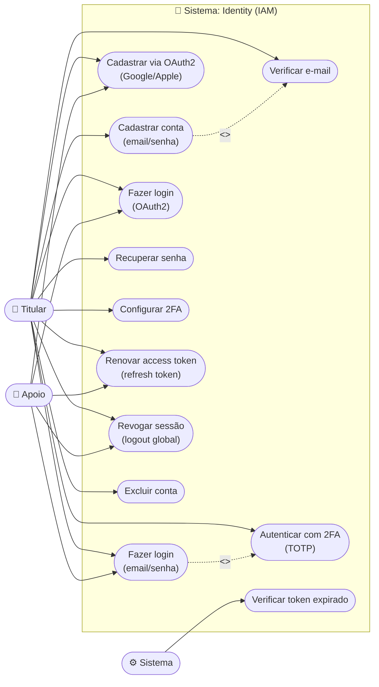
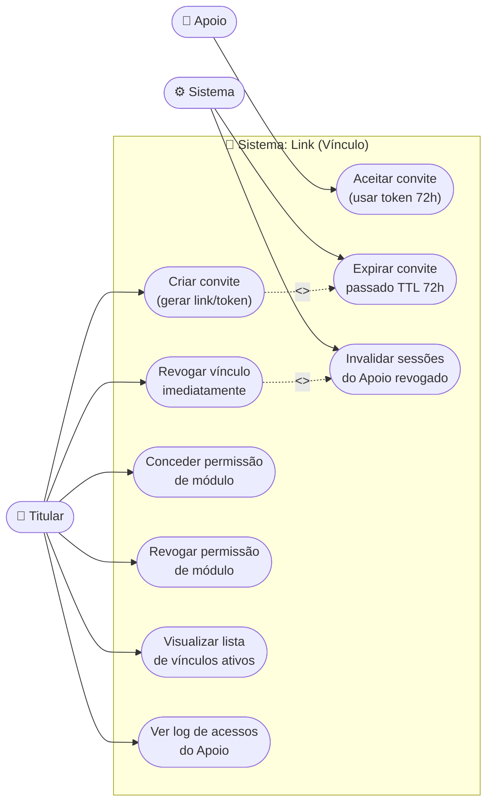
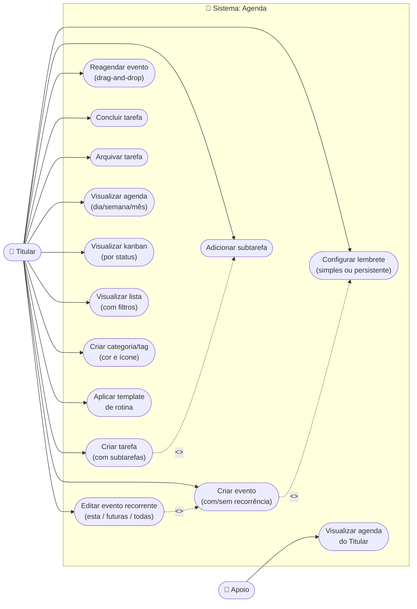
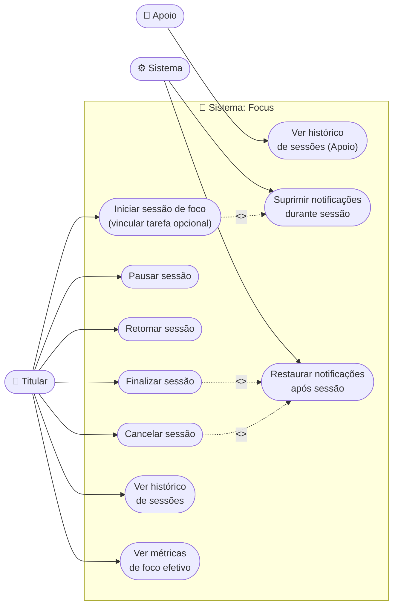
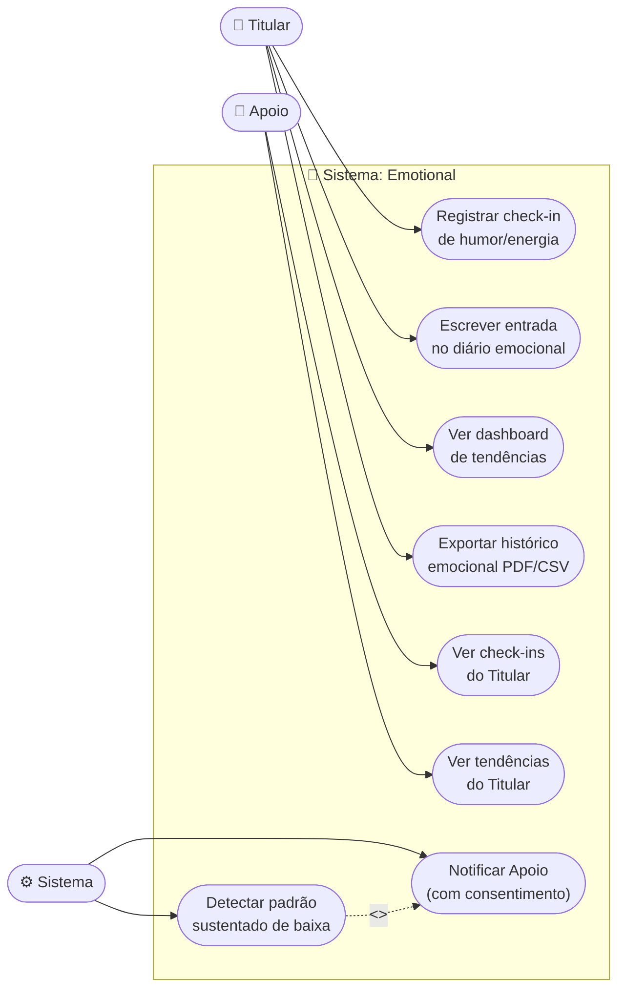
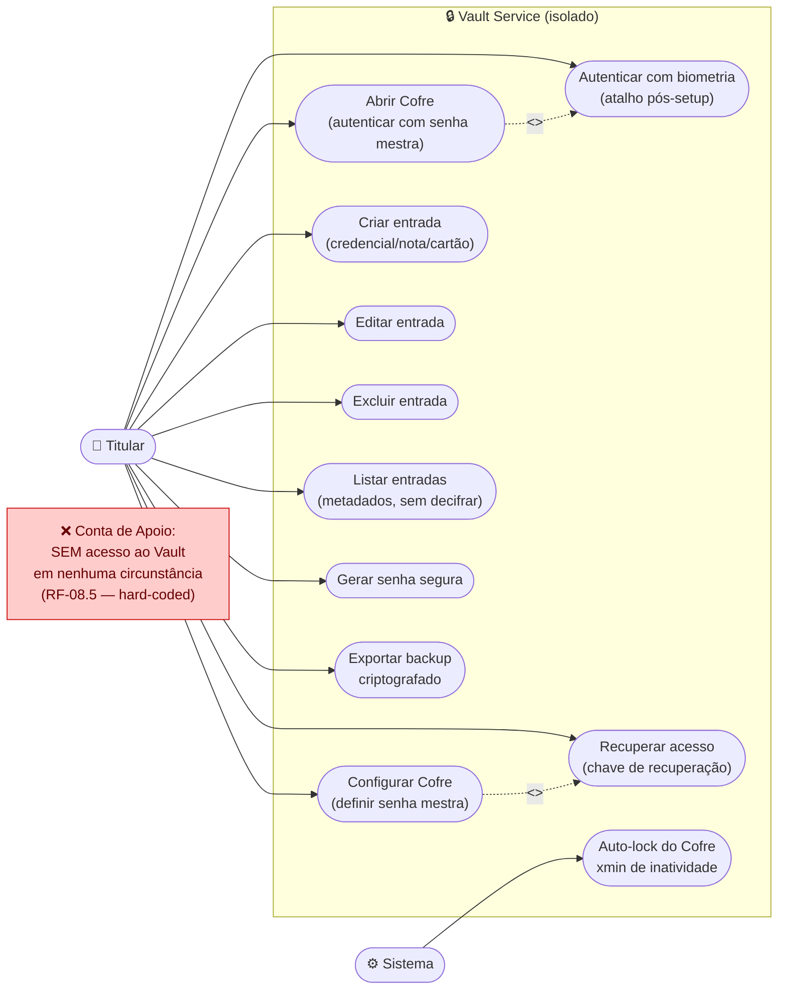
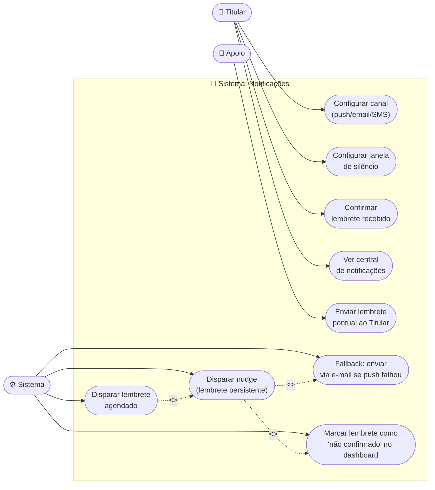
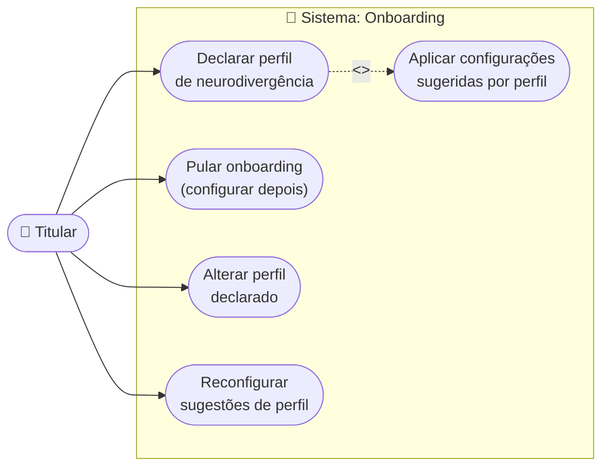
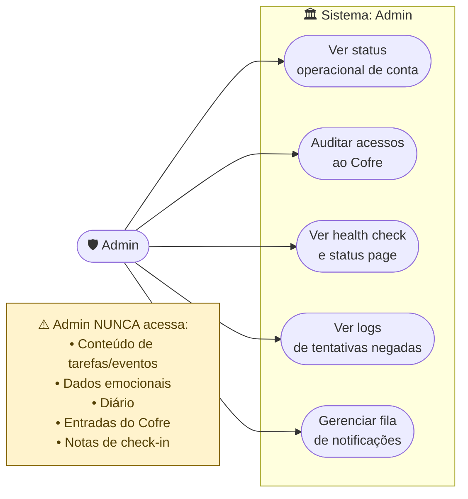

# Diagramas de Casos de Uso — Neuro-Gen

> **Atores do sistema:**
> - **Titular** — usuário neurodivergente, dono dos dados. Controla permissões e todos os módulos.
> - **Apoio** — responsável/terapeuta vinculado. Acessa apenas o que o Titular liberar (opt-in).
> - **Sistema** — processos automáticos (scheduler, fila de notificações, workers).
> - **Admin** — equipe operacional interna (acesso apenas a metadados, nunca a conteúdo sensível).
>
> **Regras transversais:**
> - Ausência de permissão explícita = acesso negado (opt-in — RF-01.3)
> - Cofre (Vault) NUNCA acessível por Apoio, independente de permissões (RF-08.5)
> - Toda ação sobre dado sensível exige verificação de permissão via `ng_link_permissions`

---

## UC-01: Autenticação e Gestão de Conta

---

## UC-02: Vínculo Titular / Apoio

> Fluxo central de permissões. Garante que Apoio só veja o que Titular liberar.
> Revogação é imediata — sessão ativa do Apoio perde acesso em < 5s (RF-01.4).

---

## UC-03: Agenda e Planner

> Titular gerencia seus eventos e tarefas.
> Apoio visualiza apenas itens marcados como compartilhados + permissão AGENDA.

---

## UC-04: Foco e Produtividade

> Sessão de foco suprime notificações não críticas (RF-04.2).
> Titular controla totalmente o ciclo da sessão.

---

## UC-05: Regulação Emocional

> **Dado sensível de saúde (LGPD art. 5º, II).**
> Apoio só acessa com permissão explícita do Titular.
> O produto nunca realiza diagnóstico clínico (RF-05).

---

## UC-06: Cofre de Senhas (Vault Service)

> **Módulo isolado — zero-knowledge (RF-08, ADR-005).**
> Apoio não tem NENHUMA rota de acesso — restrição hard-coded.
> Decriptação ocorre exclusivamente no cliente.

---

## UC-07: Notificações e Lembretes

> Sistema de entrega multi-canal com fallback.
> Apoio pode disparar lembrete pontual se permissão SEND_REMINDERS ativa (RF-01.8).

---

## UC-08: Onboarding e Perfil

> Onboarding máximo 5 telas, dispensável (RF-10.3).
> Perfil declarado apenas sugere defaults — nunca restringe (RF-10).

---

## UC-09: Administração Interna

> Acesso restrito à equipe técnica. Sem acesso a conteúdo sensível.
> Apenas metadados operacionais para suporte e auditoria de segurança.

