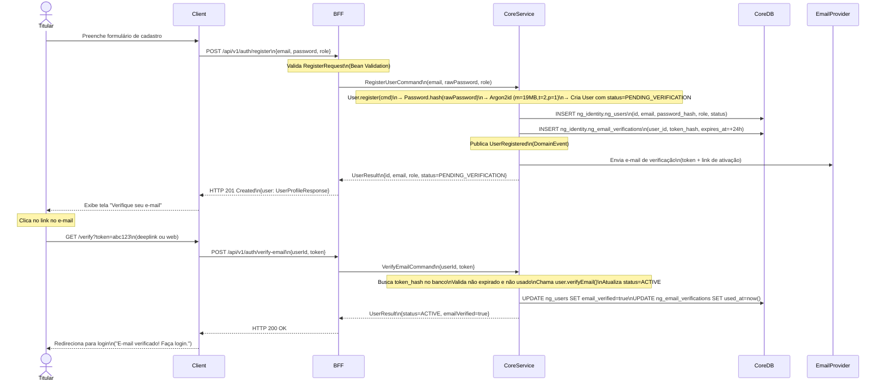
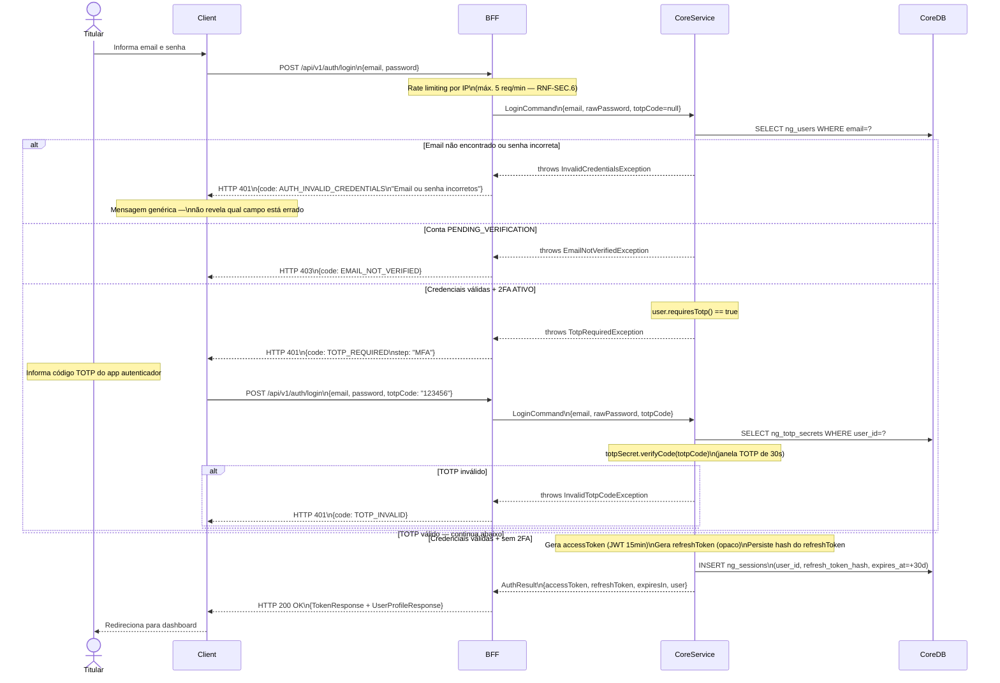
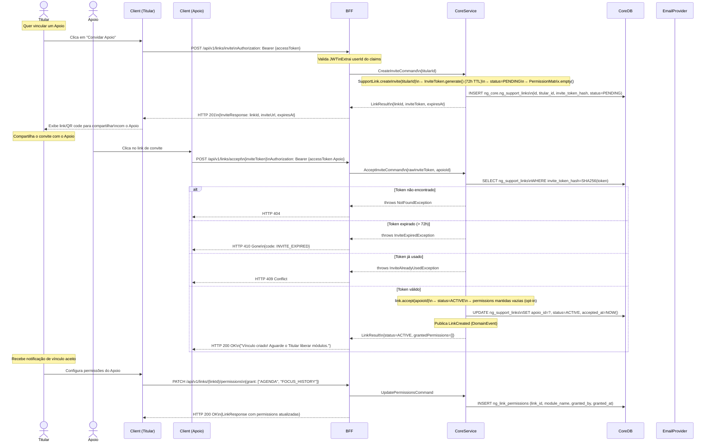
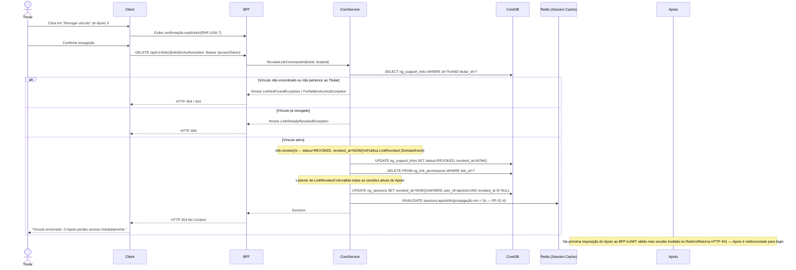
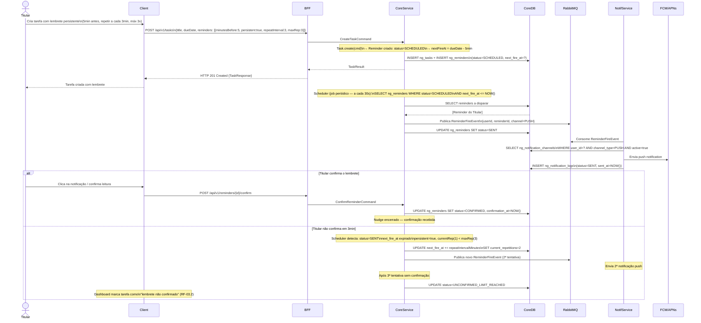
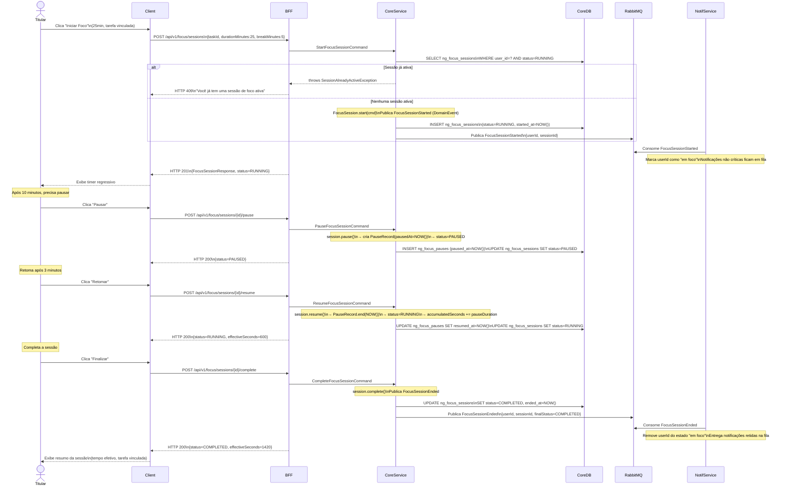
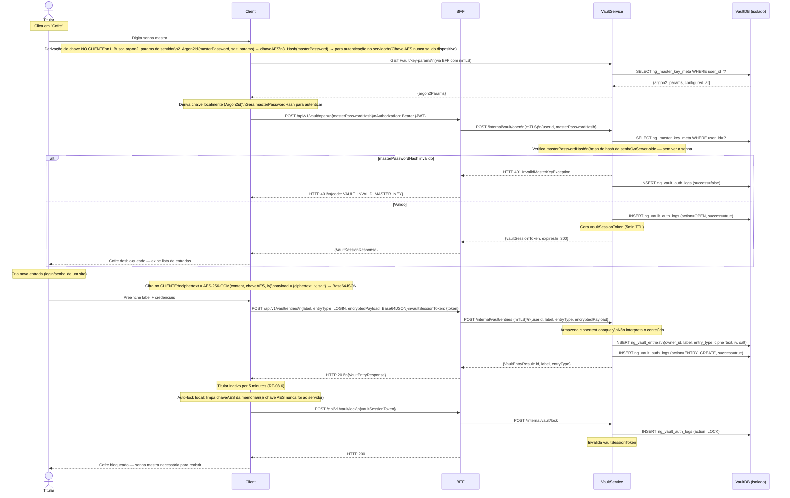
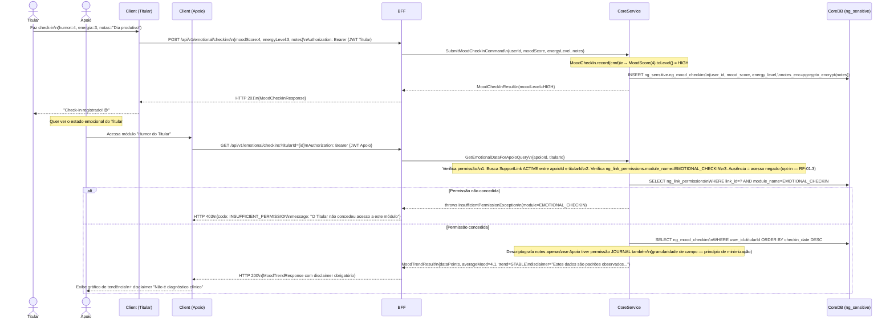
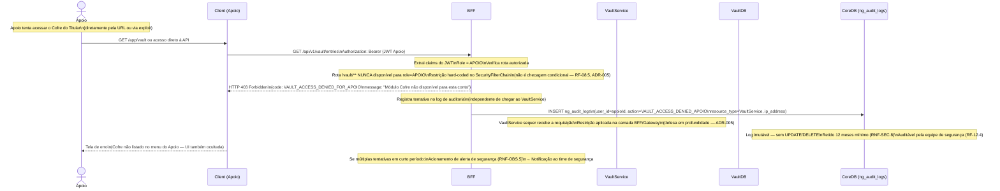

# Diagramas de Sequência — Neuro-Gen

> **Fluxos documentados:**
> 1. Registro de conta + verificação de e-mail
> 2. Login com credenciais (JWT + 2FA opcional)
> 3. Criação e aceite de vínculo Titular/Apoio
> 4. Revogação de vínculo com invalidação de sessão em tempo real
> 5. Criar tarefa com lembrete persistente (nudge)
> 6. Fluxo de sessão de foco (start → pause → resume → complete)
> 7. Acesso ao Cofre — zero-knowledge (open → create entry → auto-lock)
> 8. Check-in emocional com acesso por Apoio autorizado
> 9. Tentativa de acesso ao Vault por conta Apoio (fluxo de segurança)
>
> **Participantes recorrentes:**
> - `Client` — Web App (React) ou Mobile App (KMM)
> - `BFF` — BFF / API Gateway (Spring Boot)
> - `CoreService` — Monolito modular
> - `VaultService` — Serviço isolado (mTLS)
> - `NotifService` — Notification Service (consumer RabbitMQ)
> - `CoreDB` — PostgreSQL Core
> - `VaultDB` — PostgreSQL Vault (banco separado)
> - `Queue` — RabbitMQ

---

## SEQ-01: Registro de Conta + Verificação de E-mail

> Fluxo: cadastro → e-mail de verificação → ativação da conta (RF-01.1, RF-01.6).
> Conta permanece em `PENDING_VERIFICATION` até verificação — funcionalidades limitadas.

---

## SEQ-02: Login com Credenciais (JWT + 2FA Opcional)

> Fluxo normal e fluxo com TOTP (RF-01.9).
> Access token: JWT 15min (stateless). Refresh token: 30 dias (persistido).
> Rate limit: máx. 5 tentativas/min por IP (RNF-SEC.6).

---

## SEQ-03: Criação e Aceite de Vínculo Titular/Apoio

> Titular gera convite → Apoio aceita via token (TTL 72h — RF-01.2).
> Sem permissões concedidas no aceite — Titular configura depois (opt-in RF-01.3).

---

## SEQ-04: Revogação de Vínculo com Invalidação de Sessão

> Revogação tem efeito em < 5s — sessão ativa do Apoio perde acesso imediatamente (RF-01.4).

---

## SEQ-05: Criar Tarefa com Lembrete Persistente (Nudge)

> Nudge: lembrete que se repete M vezes a cada N minutos até confirmação (RF-03.2).
> Dispatcher no Notification Service consome fila RabbitMQ.

---

## SEQ-06: Sessão de Foco (Start → Pause → Resume → Complete)

> Ao iniciar, suprime notificações não críticas (RF-04.2).
> Retomar sessão restaura tempo acumulado sem reiniciar (RF-04.8).

---

## SEQ-07: Cofre — Abrir, Criar Entrada, Auto-lock (Zero-Knowledge)

> Chave derivada no CLIENTE com Argon2id + AES-256-GCM.
> Servidor armazena e devolve bytes cifrados — nunca interpreta (ADR-005, RNF-SEC.3).
> mTLS obrigatório entre BFF e VaultService.

---

## SEQ-08: Check-in Emocional + Acesso por Apoio Autorizado

> Dado sensível de saúde. Apoio acessa somente com permissão EMOTIONAL_CHECKIN ativa.
> Disclaimer obrigatório em toda exibição de insight emocional (RF-05).

---

## SEQ-09: Bloqueio de Acesso ao Vault por Conta Apoio

> Fluxo de segurança: demonstra que a restrição é estrutural (não apenas UI).
> Qualquer tentativa é registrada em log de segurança (RNF-SEC.8, RF-12.4).

